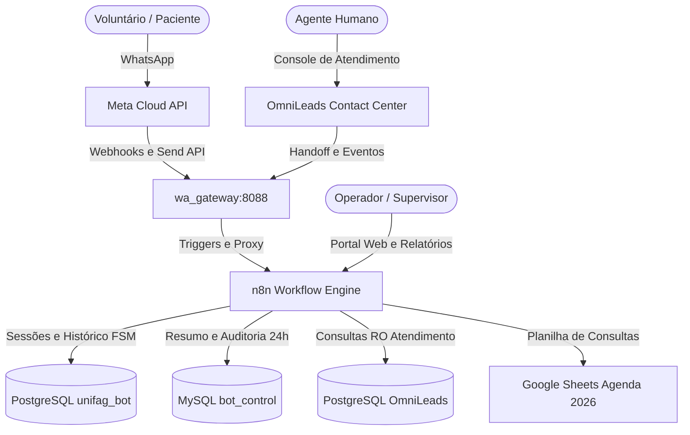

# Sistema de Documentação — Ecossistema WhatsApp & Automações UNIFAG

Bem-vindo à documentação técnica e operacional dos fluxos de automação do ecossistema de campanhas, triagem e controle de agendamentos da **UNIFAG** (Centro de Pesquisa Clínica e Estudos de Bioequivalência).

Este repositório orquestra o ciclo de vida completo de comunicação com pacientes e voluntários via WhatsApp Cloud API (Meta), integrando **n8n**, **OmniLeads (OML)**, **Google Sheets** e bancos de dados relacionais (**MySQL** e **PostgreSQL**).

---

## 🗺️ Mapa de Navegação da Documentação

A documentação está estruturada de forma modular para atender tanto engenheiros de dados e desenvolvedores quanto supervisores de atendimento e operadores clínicos:

```
docs/
├── README.md                                # Portal central e introdução ao ecossistema
├── playbook-implantacao-do-zero.md          # 🚀 Guia Mestre de Implantação do Zero (Infra, OML, n8n, Meta)
├── arquitetura/
│   ├── visao-geral.md                       # Diagrama unificado, microsserviços, ciclo de vida e gateways
│   ├── gateway-orquestracao.md              # wa_gateway Node.js, Traefik, cache de mídia e integração OML
│   ├── banco-de-dados.md                    # Dicionário de dados (MySQL, PostgreSQL, OML, DataTables)
│   └── catalogo-consultas-e-bases.md        # Catálogo exaustivo de queries SQL, buscas de API e servidores
├── fluxos/
│   ├── 01-sincronizacao-agenda.md           # Fluxo 1: Sincronização Google Sheets → MySQL & Atribuição
│   ├── 02-campanhas-whatsapp.md             # Fluxo 2: Disparo em massa, proteção 24h, templates e usuários
│   ├── 03-dashboard-relatorios-bi.md        # Fluxo 3: Portal executivo, BI de custos Meta e OML
│   └── 04-bot-triagem-atendimento.md        # Fluxo 4: Bot IA com FSM determinística e handoff humano
└── operacao/
    ├── manual-operador.md                   # Guia de operação para equipe de campo/atendimento
    ├── troubleshooting.md                   # Catálogo de erros Meta, travas de bot e resolução de falhas
    └── guia-implantacao-omnileads-usf.md    # Implantação, manutenção, upgrade e telefonia OMNiLeads (USF)
```

---

## ⚡ Visão Panorâmica dos 4 Fluxos Core

| # | Fluxo n8n | Identificador | Finalidade Principal |
|---|---|---|---|
| **01** | [**Sincroniza Agenda OML**](fluxos/01-sincronizacao-agenda.md) | `1yuqoeWSRkcq1fM2` | Lê a planilha `AGENDA 2026`, gera identificador estável, sincroniza no MySQL `campanha_agendamentos` e atribui a conversão à última campanha do contato. |
| **02** | [**Campanhas WhatsApp & Controle 24h**](fluxos/02-campanhas-whatsapp.md) | `wpwQBe7OIUvzGvRZ` | Portal web para envio de mensagens ativas com validação prévia de janela de 24h (`blocked_24h`), gestão de modelos Meta e controle de acesso com RBAC. |
| **03** | [**Dashboard & Relatórios 24h**](fluxos/03-dashboard-relatorios-bi.md) | `vETUs2AnPvfrSHSU` | Painel executivo analítico com métricas de funil, BI financeiro com custos oficiais da Meta via API (`template_analytics`) e auditoria de atendimento OML. |
| **04** | [**Bot com Registro de Respostas**](fluxos/04-bot-triagem-atendimento.md) | `mtbFAvtEk3YwcsAB` | Atendimento receptivo inteligente com Máquina de Estados Finita (FSM) via Google Gemini, triagem de voluntários de pesquisa e handoff para o OmniLeads. |

---

## 🏗️ Matriz de Responsabilidade dos Componentes



* **Meta WhatsApp Cloud API**: Barramento oficial de mensageria com templates aprovados e webhooks de entrega/leitura.
* **wa_gateway (Porta 8088)**: Proxy de mensageria, gerenciador de travas ativas de bot (`/control/lock/{wa_id}/on|off`) e encaminhamento para o OmniLeads.
* **n8n Orchestrator**: Motor de integração que processa as regras de negócio, interfaces web autenticadas e orquestração de banco.
* **MySQL (`bot_control`)**: Repositório operacional de campanhas, deduplicação de agendamentos, travas de contatos e auditoria de faturamento.
* **PostgreSQL (`unifag_bot`)**: Repositório de sessões conversacionais em tempo real, memória do bot de IA e deduplicação de mensagens recebidas.
* **PostgreSQL (`OML_Postgres_RO`)**: Banco analítico de leitura do OmniLeads para auditar tempo de resposta e conversas abandonadas sem atendimento.
* **Google Sheets**: Repositório compartilhado com o setor médico/clínico para registro da agenda e presença dos voluntários.

---

## 🔗 Links Rápidos
 
* [🚀 Playbook de Implantação do Zero (Guia Mestre)](playbook-implantacao-do-zero.md)
* [Arquitetura e Fluxo Integrado](arquitetura/visao-geral.md)
* [Gateway de Orquestração, Traefik & OML](arquitetura/gateway-orquestracao.md)
* [Estrutura Completa de Tabelas e Schemas](arquitetura/banco-de-dados.md)
* [Catálogo Completo de Consultas SQL & Buscas](arquitetura/catalogo-consultas-e-bases.md)
* [Manual do Operador](operacao/manual-operador.md)
* [Guia de Troubleshooting e Erros](operacao/troubleshooting.md)
* [Guia de Implantação e Telefonia OMNiLeads (USF)](operacao/guia-implantacao-omnileads-usf.md)
