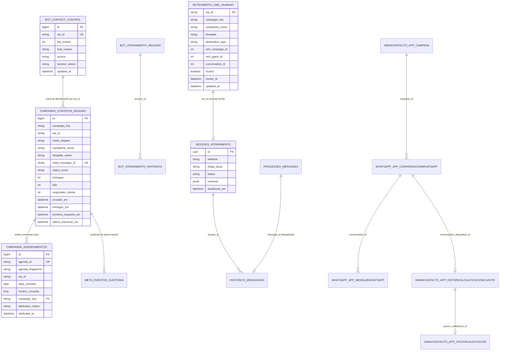

# Dicionário de Dados & Modelagem — UNIFAG

Este documento consolida o esquema físico de dados, relacionamentos, dicionário de campos e papéis operacionais de todas as tabelas utilizadas pelos fluxos n8n, abrangendo os bancos **MySQL** (`bot_control`), **PostgreSQL** (`unifag_bot`), **PostgreSQL OmniLeads** (`OML_Postgres_RO`) e **Data Tables do n8n**.

> 🔍 **Catálogo Detalhado de Consultas**:  
> Para consultar a listagem de **todas as queries SQL na íntegra, buscas de API, DataTables e mapeamento dos 5 servidores/containers**, acesse o documento dedicado: [**`docs/arquitetura/catalogo-consultas-e-bases.md`**](catalogo-consultas-e-bases.md).

---

## 0. Mapeamento dos Servidores & Containers de Banco

| Serviço / Container | Host & Portas | Usuário | Senha | Banco de Dados / Função Principal |
|---|---|---|---|---|
| **`mysql_mysql`** | `3306 / 33060` | `root` / `bot_user` | `[PROTEGIDO / ENV]` | **`bot_control`**: Campanhas, agendamentos, travas de bot e auditoria Meta |
| **`unifag-omnihub_mysql`** | `3306 / 33060` | `root` | `[PROTEGIDO / ENV]` | **`omnihub`**: Banco interno da plataforma OmniHub (instâncias e filas do hub) |
| **`postgres_postgres`** | `5432` | `unifag_admin` / `oml_user` | `[PROTEGIDO / ENV]` | **`unifag_bot`**: Sessões e histórico FSM do bot \| **OmniLeads**: Relatórios OML |
| **`redis_redis`** | `6379` | Default | *(Sem senha / Interno)* | **Cache Geral & Filas do n8n**: Rate limit, locks atômicos e filas de execução |
| **`unifag-omnihub_redis`** | `6379` | Default | *(Sem senha / Interno)* | **Broker do OmniHub**: Eventos em tempo real, sockets e filas BullMQ do WhatsApp |

---

## 1. Diagrama Entidade-Relacionamento Unificado

---

## 2. Banco de Dados MySQL: `bot_control`

Credencial n8n: `bot_control` (`Douv0MMoaoiQSOUc`). Porta padrão: `3306`.

### 2.1. Tabela: `campanha_contatos_resumo`
Centraliza o ciclo de vida de cada envio de campanha, atualizada em tempo real por disparos, webhooks da Meta e interações com o Bot.

| Campo | Tipo | Descrição e Regras |
|---|---|---|
| `id` | `BIGINT AUTO_INCREMENT` | Identificador primário único do registro de envio. |
| `campaign_key` | `VARCHAR(120)` | Chave única da execução da campanha (`{timestamp}__{template_name}`). |
| `wa_id` | `VARCHAR(50)` | Telefone normalizado com DDI 55 + DDD + Número (ex: `5511999998888`). |
| `modo_disparo` | `VARCHAR(50)` | Modo selecionado no formulário: `'bot'` ou `'humano'` / `'human'`. |
| `campanha_nome` | `VARCHAR(255)` | Rótulo amigável da campanha informado pelo operador. |
| `template_name` | `VARCHAR(255)` | Nome técnico do modelo aprovado na Meta (ex: `unifag_personalizado`). |
| `template_language_code`| `VARCHAR(20)` | Código do idioma Meta (ex: `pt_BR`). |
| `message_text` | `TEXT` | Texto completo enviado, com variáveis preenchidas. |
| `meta_message_id` | `VARCHAR(150)` | Identificador `wamid.xxx` retornado pela Meta Send API. Permite `NULL` quando bloqueado. |
| `status_envio` | `VARCHAR(50)` | Situação atual: `'sent'`, `'delivered'`, `'read'`, `'failed'`, `'blocked_24h'`. |
| `entregue` | `TINYINT(1)` | `1` quando a Meta confirma evento `delivered` ou `read`. |
| `lida` | `TINYINT(1)` | `1` quando a Meta confirma evento `read`. |
| `respondeu_cliente` | `TINYINT(1)` | `1` se o contato enviou qualquer mensagem após o envio da campanha. |
| `primeira_mensagem_cliente` | `TEXT` | Texto da primeira resposta enviada pelo cliente. |
| `ultima_mensagem_cliente` | `TEXT` | Texto da última mensagem recebida do cliente. |
| `quantidade_interacoes` | `INT` | Contagem acumulada de mensagens trocadas com o contato. |
| `primeira_resposta_em` | `DATETIME` | Data/hora exata em que o cliente respondeu pela primeira vez. |
| `ultima_resposta_bot` | `TEXT` | Último texto respondido pelo Bot inteligente para o contato. |
| `enviado_em` | `DATETIME` | Data e hora em que a mensagem foi aceita pela Meta Send API. |
| `entregue_em` | `DATETIME` | Data/hora convertida via `FROM_UNIXTIME()` do status `delivered`. |
| `solicitacao_nome_cpf_status` | `VARCHAR(50)` | Controle de campanhas humanas: `'nao_enviada'`, `'processando'`, `'enviada'`, `'falhou'`. |
| `solicitacao_nome_cpf_em` | `DATETIME` | Momento em que foi solicitada a identificação do contato humano. |
| `observacoes` | `TEXT` | Detalhes de erro Meta (código + mensagem) ou motivos de bloqueio preventivo. |
| `updated_at` | `DATETIME` | Atualizado automaticamente a cada mudança de estado. |

---

### 2.2. Tabela: `campanha_agendamentos`
Armazena os registros capturados na planilha Google Sheets `AGENDA 2026` e realiza a atribuição de conversão.

| Campo | Tipo | Descrição e Regras |
|---|---|---|
| `id` | `BIGINT AUTO_INCREMENT` | Identificador único interno. |
| `agenda_id` | `VARCHAR(64)` | Identificador estável da linha da planilha (ex: `AGENDA-20260930164220-00125-001`). `UNIQUE`. |
| `agenda_fingerprint` | `CHAR(64)` | Hash SHA-256 do payload para garantir integridade e detectar alterações. |
| `source_sheet` | `VARCHAR(100)` | Nome da aba de origem (`AGENDA 2026`). |
| `source_row` | `INT` | Número da linha na planilha do Google Sheets. |
| `participante_nome` | `VARCHAR(255)` | Nome do voluntário/paciente registrado na planilha. |
| `telefone_original` | `VARCHAR(50)` | Telefone bruto como foi digitado na planilha. |
| `wa_id` | `VARCHAR(50)` | Telefone normalizado para busca cruzada (DDI 55...). |
| `data_consulta` | `DATE` | Data agendada da consulta médica (formato `YYYY-MM-DD`). |
| `horario_consulta` | `TIME` | Horário agendado da consulta médica (formato `HH:MM:SS`). |
| `medico` | `VARCHAR(150)` | Nome do médico responsável pela consulta. |
| `via_entrada` | `VARCHAR(100)` | Filtrado exclusivamente para `OMNILEADS`. |
| `tipo_consulta` | `VARCHAR(150)` | Tipo da consulta (ex: Triagem, Retorno, Coleta). |
| `como_ficou_sabendo` | `VARCHAR(255)` | Canal declarado de aquisição do voluntário. |
| `agendado_por` | `VARCHAR(150)` | Atendente ou operador que registrou a agenda. |
| `status_pasta_pp` | `VARCHAR(100)` | Status da pasta de pesquisa clínica. |
| `confirmacao_presenca` | `VARCHAR(100)` | Confirmação prévia de comparecimento. |
| `status_presenca` | `VARCHAR(100)` | Resultado do comparecimento: `'PRESENTE'`, `'AUSENTE'`, etc. |
| `status_consulta` | `VARCHAR(100)` | Avaliação médica do voluntário: `'APTO'`, `'INAPTO'`, etc. |
| `atendido_por` | `VARCHAR(150)` | Profissional que atendeu a consulta. |
| `observacao` | `TEXT` | Observações clínicas ou de protocolo CNSP. |
| `campaign_key` | `VARCHAR(120)` | Campanha vinculada retroativamente à conversão. |
| `campanha_contato_id` | `BIGINT` | ID da linha correspondente em `campanha_contatos_resumo`. |
| `attribution_status` | `VARCHAR(50)` | `'atribuido'` (encontrou campanha enviada antes da consulta) ou `'sem_campanha'`. |
| `attribution_method` | `VARCHAR(100)` | `'ultima_campanha_antes_deteccao_agenda'`. |
| `attributed_at` | `DATETIME` | Data e hora em que a atribuição foi consolidada. |
| `baseline_historico` | `TINYINT(1)` | `1` para os 660 registros anteriores ao início do projeto; `0` para conversões reais novas. |
| `first_seen_at` | `DATETIME` | Primeira vez que este agendamento foi lido da planilha. |
| `last_seen_at` | `DATETIME` | Última sincronização em que este agendamento permaneceu presente. |

---

### 2.3. Tabela: `bot_contact_control`
Controla as travas de contato em atendimento humano, impedindo o Bot de colidir com os operadores.

| Campo | Tipo | Descrição e Regras |
|---|---|---|
| `wa_id` | `VARCHAR(50)` | Telefone do voluntário (`UNIQUE`). |
| `bot_locked` | `TINYINT(1)` | `1` = Bot travado (atendimento humano ativo); `0` = Bot livre. |
| `lock_reason` | `VARCHAR(255)` | Motivo da trava: `'agent_started'`, `'manual_release'`, `'timeout'`. |
| `source` | `VARCHAR(100)` | Origem do lock: `'agent'` (humano), `'n8n_mass_human'`, `'bot'`. |
| `session_status` | `VARCHAR(100)` | Situação atual da sessão: `'human'` ou `'bot'`. |
| `updated_at` | `DATETIME` | Timestamp para cálculo da janela de validade da trava (30 minutos). |

---

### 2.4. Tabelas: `bot_atendimento_resumo` e `bot_atendimento_historico`
Armazenam a consolidação da triagem realizada pelo bot para consulta rápida e auditoria:

* **`bot_atendimento_resumo`**: Chave primária `session_id`. Armazena o resumo consolidado no formato:
  `1. Pergunta => Resposta | 2. Pergunta => Resposta`, motivo de handoff e dados de campanha.
* **`bot_atendimento_historico`**: Registra cada pergunta feita pelo Bot e a respectiva resposta do usuário de forma tabular e sequencial (`ordem = 1, 2, 3...`), com chave única `(session_id, ordem)`.

---

### 2.5. Tabela: `meta_eventos_auditoria`
Trilha de auditoria pura (raw/structured log) de todos os eventos recebidos da Meta WhatsApp Cloud API:

* Armazena `event_uid` (`status:wamid:status:epoch:code` ou `inbound:wamid`).
* Dados de cobrança da Meta: `pricing_billable` (`1`/`0`), `pricing_category` (`MARKETING`, `UTILITY`, `AUTHENTICATION`, `SERVICE`), `pricing_model` (`CBP`), `conversation_origin_type`.
* Payloads completos JSON: `conversation_json`, `pricing_json`, `errors_json`, `meta_raw_json` e `meta_headers_json`.

---

## 3. Banco de Dados PostgreSQL: `unifag_bot`

Credencial n8n: `Unifag_Bot` (`RLZJxPIN5hWeeHIB`). Porta mapeada: `5434` (host) / `5432` (container).

### 3.1. Tabela: `unifag_bot.sessoes_atendimento`
Gerencia a máquina de estados do Bot inteligente:

| Campo | Tipo | Descrição |
|---|---|---|
| `id` | `UUID` | Identificador único da sessão (chave primária). |
| `telefone` | `VARCHAR(50)` | Telefone WhatsApp (`wa_id`). |
| `nome_contato` | `VARCHAR(255)` | Nome informado no perfil do WhatsApp ou capturado no fluxo. |
| `etapa_atual` | `VARCHAR(100)` | Estado da FSM (ex: `entrada`, `SOLICITAR_NOME`, `MENU_PRINCIPAL`, `handoff`, `encerrado`). |
| `status` | `VARCHAR(50)` | Estado geral: `'ativo'`, `'humano'`, `'encerrado'`. |
| `contexto` | `JSONB` | Dados da sessão: histórico `historico_qa`, campanha de origem, motivo de handoff e encerramento. |
| `atualizado_em`| `TIMESTAMPTZ` | Timestamp para controle de inatividade (timeout de 30 minutos). |

### 3.2. Tabela: `unifag_bot.historico_mensagens`
Registra cada mensagem trocada durante o atendimento:

* `sessao_id`: Referência à sessão em `sessoes_atendimento`.
* `autor`: `'usuario'` ou `'bot'`.
* `mensagem`: Conteúdo textual transmitido.
* `metadata`: Objeto `JSONB` contendo `wa_id`, `message_id`, etapa no momento do envio e flags de handoff.

### 3.3. Tabela: `unifag_bot.processed_messages`
Garante a idempotência de webhooks:
* `message_id` (`VARCHAR(255) PRIMARY KEY`): Identificador único da mensagem (`wamid`).
* `created_at` (`TIMESTAMPTZ`): Data e hora do primeiro processamento.

### 3.4. Tabela: `unifag_bot.roteamento_oml_humano`
Persiste a fila e metadados de transferência direta para o OmniLeads acionada pelo `wa_gateway:8088` (`/opt/wa-gateway/index.js`) quando um contato é disparado via **Modo Humano**:

| Campo | Tipo | Descrição e Regras |
|---|---|---|
| `wa_id` | `VARCHAR(50) PRIMARY KEY` | Telefone WhatsApp do contato (ex: `5511999998888`). |
| `campaign_key` | `VARCHAR(120)` | Identificador único da campanha disparada no n8n. |
| `campanha_nome` | `VARCHAR(255)` | Rótulo amigável da campanha de disparo. |
| `template` | `VARCHAR(255)` | Nome do template WhatsApp enviado ao contato. |
| `destination_type` | `VARCHAR(50)` | Tipo de destino no OmniLeads: `'campaign'` ou `'agent'`. |
| `oml_campaign_id` | `INT` | ID numérico da campanha/fila OML receptora. |
| `oml_campaign_name` | `VARCHAR(255)` | Nome amigável da campanha OML. |
| `oml_agent_id` | `INT` | ID do agente específico (quando `destination_type = 'agent'`). |
| `oml_agent_name` | `VARCHAR(255)` | Nome do agente específico de atendimento. |
| `conversation_id` | `INT` | ID da conversa criada no tronco OML (Tronco `111` - `UNIFAG_WHATSAPPV1`). |
| `routed` | `BOOLEAN DEFAULT FALSE` | `false` = aguardando primeira resposta para transferência; `true` = transferido com sucesso no OML. |
| `routed_at` | `TIMESTAMPTZ` | Data e hora exata em que a transferência no OML foi consumada. |
| `updated_at` | `TIMESTAMPTZ DEFAULT NOW()` | Data e hora da última modificação do registro. |

> ⚙️ **Ciclo de Roteamento OML**:  
> 1. O Fluxo 2 dispara a campanha humana e chama o `wa_gateway` para registrar a intenção de roteamento (`destination_type`, `oml_campaign_id` etc.).  
> 2. O `wa_gateway` faz o *UPSERT* em `unifag_bot.roteamento_oml_humano`.  
> 3. Quando o cliente responde, a conversa no tronco OML `111` é localizada e transferida automaticamente via API interna (`/api/v1/whatsapp/transfer/to_campaign/` ou `/transfer/to_agent/`), marcando `routed = true` e registrando o `conversation_id`.

---

## 4. Banco de Dados PostgreSQL: OmniLeads (`OML_Postgres_RO`)

Acessado em modo somente leitura (RO) pelo Fluxo 3 para auditoria de atendimento humano:

* **`whatsapp_app_conversacionwhatsapp`**: Tabela principal de conversas OML. Contém `conversation_id`, `destination` (telefone do cliente), `expire` (timestamp de expiração da janela de 24h), `is_disposition` (se a conversa foi encerrada/qualificada) e `conversation_disposition_id`.
* **`whatsapp_app_mensajewhatsapp`**: Mensagens da conversa. Usada para detectar se o operador humano respondeu o voluntário após o último inbound (`mo.timestamp > ultimo_cliente_em AND mo.sender->>'agent_id' IS NOT NULL`).
* **`ominicontacto_app_campana`**: Metadados da campanha OML (`id`, `nombre`, `whatsapp_habilitado`).
* **`ominicontacto_app_historicalcalificacioncliente`** & **`ominicontacto_app_opcioncalificacion`**: Armazena o motivo de encerramento selecionado pelo operador na qualificação da conversa.

---

## 5. Data Tables do n8n

O n8n mantém tabelas internas com persistência local de alta performance:

### 5.1. Data Table: `wa_automation_config` (`3nQw8DRKimYrWwZb`)
* **Tokens de Sessão**: chaves `auth.session.{token}` com expiração em 8 horas (`value_number` = epoch ms) e JSON de usuário em `value_string`.
* **Usuários do Painel**: chaves `auth.user.{email}` com nome, papel (`admin`, `supervisor`, `user`), salt e hash SHA-512 da senha, e flag `must_change_password`.
* **Catálogo de Templates**: chaves `template.{name}.{language}` com status na Meta (`APPROVED`, `REJECTED`, etc.), texto completo aprovado, quantidade de variáveis e status de ativação.
* **Parâmetros de Disparo**: chaves globais como `phone_number_id`, `delay_segundos` e `lock_expiration_minutes`.

### 5.2. Data Table: `dashboard_usuarios` (`oE3mO5aUWr2pIC40`)
* Armazena os usuários de acesso ao Dashboard executivo (`/webhook/whasoml`), controlando autenticação via cookie `whasoml_session`, hash de senha com salt e obrigatoriedade de troca de senha no primeiro login.
