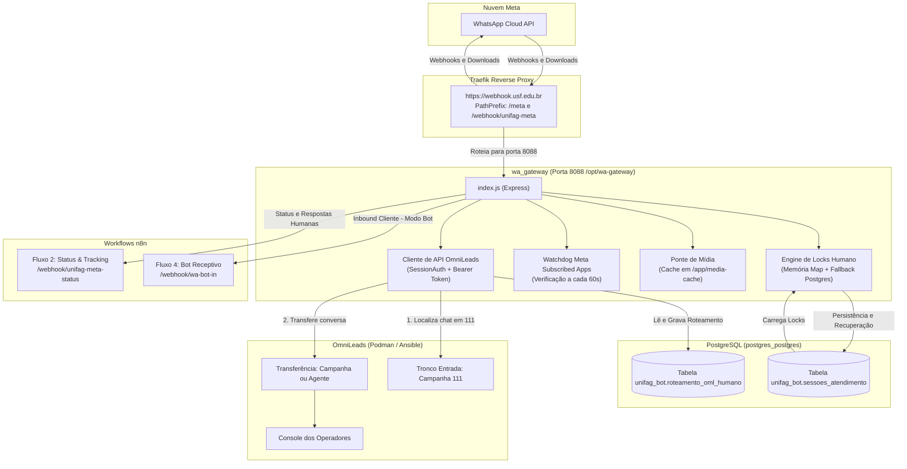

# Gateway de Orquestração — `wa_gateway` (Node.js & Traefik)

Este documento detalha o microsserviço de borda **`wa_gateway`**, responsável pela orquestração central de mensageria entre a **Meta WhatsApp Cloud API**, o **OmniLeads (OML)** e os fluxos do **n8n**.

O serviço opera no host `DCNTXRDSTATION` no diretório `/opt/wa-gateway` e é gerenciado via **Portainer** com roteamento seguro via **Traefik**.

---

## 1. Visão Geral e Papel no Ecossistema

O `wa_gateway` atua como o cérebro de infraestrutura da comunicação WhatsApp na UNIFAG, resolvendo quatro desafios críticos de integração:

1. **Roteamento Inteligente de Entrada**: Separa mensagens de clientes em triagem pelo Bot daquelas que pertencem a operadores humanos do OmniLeads.
2. **Transferência Dinâmica no OmniLeads (OML 2.5.6)**: Localiza conversas no tronco padrão (`Campanha 111 - UNIFAG_WHATSAPPV1`) e as transfere via API para a campanha ou agente selecionado na campanha do n8n.
3. **Ponte de Mídia com Cache Local (`media-cache`)**: Baixa áudios, imagens, documentos e vídeos da Meta e gera URLs temporárias protegidas via Traefik (`/meta/media/:token`), contornando limitações de download direto pelo OmniLeads.
4. **Guardião de Webhook da Meta (*Watchdog*)**: Monitora a cada 60 segundos se o aplicativo WABA está devidamente inscrito (`subscribed_apps`) e re-inscreve automaticamente caso a Meta desative a assinatura.



---

## 2. Orquestração Docker Swarm & Stack no Portainer (`node_meta`)

O serviço roda sob **Docker Swarm Mode** gerenciado através da interface web do **Portainer Community Edition** (endpoint `primary`).

### 2.1. Metadados do Serviço e Task Swarm

Com base nas definições de produção inspecionadas no Portainer:
* **Nome da Stack**: `node_meta` (`com.docker.stack.namespace = node_meta`)
* **Nome do Serviço Swarm**: `node_meta_wa_gateway`
* **Nome da Task / Container**: `node_meta_wa_gateway.1.<task_id>` (ex: `node_meta_wa_gateway.1.mnm8jz85ktqdvdu3oo673lg4b`)
* **ID do Serviço Swarm**: `8xf8d2sw7r0g05vsxy8bsuip14`
* **Mapeamento de Volume (Bind Mount)**:
  * Host no servidor `DCNTXRDSTATION`: `/opt/wa-gateway`
  * Caminho interno no container: `/app`
* **Rede Conectada**: `network_public` (compartilhada com Traefik e n8n)
* **Controle de Acesso**: Herdado da stack `node_meta` (Ownership: `public`)

### 2.2. Arquivo Docker Compose / Stack Portainer (`node_meta`)

```yaml
version: "3.7"

services:
  wa_gateway:
    image: node:20
    restart: unless-stopped
    working_dir: /app
    volumes:
      - /opt/wa-gateway:/app
    environment:
      TZ: America/Sao_Paulo
      PORT: 8088
      VERIFY_TOKEN: [PROTEGIDO / usf_verify_2026]
      N8N_BOT_URL: http://n8n_n8nlejajxp_webhook:5678/webhook/wa-bot-in
      N8N_STATUS_URL: http://n8n_n8nlejajxp_webhook:5678/webhook/unifag-meta-status
      OML_HANDOFF_URL: https://oml.usf.edu.br/webhooks/whatsapp/incoming/
      OML_API_BASE_URL: https://oml.usf.edu.br
      OML_API_CREDENTIAL_FILE: /app/.oml-api-unifag.cred
      OML_SESSION_CREDENTIAL_FILE: /app/.oml-session-admin.cred
      META_TOKEN: [PROTEGIDO / ENV]
      META_GRAPH_VERSION: v20.0
      META_WABA_ID: "1156659843285011"
      META_APP_ID: "1937257670036344"
      PUBLIC_WEBHOOK_BASE_URL: https://webhook.usf.edu.br
      MEDIA_CACHE_DIR: /app/media-cache
      MEDIA_LINK_TTL_HOURS: 168
      MEDIA_MAX_BYTES: 26214400 # 25MB
      MEDIA_PUBLIC_PREFIX: /meta/media
      WEBHOOK_WATCHDOG_ENABLED: "true"
      WEBHOOK_WATCHDOG_INTERVAL_MS: 60000
      PGHOST: postgres
      PGPORT: 5432
      PGDATABASE: unifag_bot
      PGUSER: postgres
      PGPASSWORD: [PROTEGIDO / ENV]
    command: >
      sh -c "
        npm install &&
        node index.js
      "
    networks:
      - network_public
    deploy:
      mode: replicated
      replicas: 1
      placement:
        constraints:
          - node.role == manager
      labels:
        - "traefik.enable=true"
        - "traefik.http.routers.wa_gateway.rule=Host(`webhook.usf.edu.br`) && (PathPrefix(`/meta`) || PathPrefix(`/webhook/unifag-meta`))"
        - "traefik.http.routers.wa_gateway.priority=100"
        - "traefik.http.routers.wa_gateway.entrypoints=websecure"
        - "traefik.http.routers.wa_gateway.tls.certresolver=letsencryptresolver"
        - "traefik.http.middlewares.wa_meta_to_webhook.replacepathregex.regex=^/meta/(.*)"
        - "traefik.http.middlewares.wa_meta_to_webhook.replacepathregex.replacement=/webhook/$1"
        - "traefik.http.services.wa_gateway.loadbalancer.server.port=8088"

networks:
  network_public:
    external: true
```

---

## 3. Anatomia do Arquivo `index.js` & Operação no Servidor

### 3.1. Operação via Terminal (CLI) e via Portainer Web UI

Como o serviço é gerenciado pelo **Docker Swarm**, os comandos diretos do Docker standalone (como `docker restart wa_gateway`) não encontram o container pelo nome simples. Abaixo estão os comandos corretos para CLI e os atalhos gráficos pelo Portainer:

#### A. Comandos de Terminal no Servidor Linux (`DCNTXRDSTATION`):

| Finalidade | Comando Linux / Bash | Descrição |
|---|---|---|
| **Editar o arquivo no editor interativo** | `nano /opt/wa-gateway/index.js` | Abre no editor GNU nano (`Ctrl+O` salva, `Ctrl+X` sai). |
| **Exibir todo o código na tela** | `cat /opt/wa-gateway/index.js` | Imprime o código-fonte integral no terminal. |
| **Ver apenas os parâmetros de configuração** | `head -n 45 /opt/wa-gateway/index.js` | Exibe as primeiras 45 linhas contendo todos os `const` e variáveis de ambiente. |
| **Visualizar o código com rolagem/paginação** | `less /opt/wa-gateway/index.js` | Permite rolar com setas e buscar texto com `/` (pressione `q` para sair). |
| **Buscar parâmetros específicos com linha** | `grep -n -E "const |PORT|VERIFY|OML|META" /opt/wa-gateway/index.js` | Lista as declarações de configuração com o número de cada linha. |
| **Recarregar / Reiniciar o serviço Swarm** | `docker service update --force node_meta_wa_gateway` | **Comando oficial do Swarm**: recria a task do container aplicando alterações de código ou volume sem downtime. |
| **Acompanhar logs do serviço Swarm** | `docker service logs -f --tail 100 node_meta_wa_gateway` | Monitora em tempo real os logs centralizados do serviço no Swarm. |
| **Localizar o container ativo da task** | `docker ps --filter "name=node_meta_wa_gateway"` | Lista o container atual (nome: `node_meta_wa_gateway.1.<task_id>`). |
| **Acessar o terminal do container via CLI** | `docker exec -it $(docker ps -q --filter "name=node_meta_wa_gateway") /bin/sh` | Abre uma sessão interativa de shell dentro do container ativo. |

#### B. Operação Visual pelo Portainer Web UI:

No Portainer (ambiente `primary`), você pode operar o serviço diretamente pelo navegador sem precisar abrir o terminal SSH:

1. **Acessar os Logs Graficamente**:
   * Acesse o menu lateral **Containers**.
   * Localize o container `node_meta_wa_gateway.1.<task_id>`.
   * Clique no ícone 📄 (**Logs**) para ver a saída em tempo real (com filtros de busca e opção de auto-refresh).
2. **Abrir Terminal Console (Shell) pelo Navegador**:
   * Na lista de containers ou na tela de detalhes, clique no ícone `>_` (**Console**).
   * Escolha o shell `/bin/sh` (ou `/bin/bash`), usuário `root` e clique em **Connect**.
   * Você terá um terminal completo dentro de `/app` direto na tela.
3. **Reiniciar o Container**:
   * Na tela **Container details**, clique no botão **Restart** (no bloco *Actions*).
   * Ou no menu **Services** ➔ clique em `node_meta_wa_gateway` ➔ clique em **Update service** com a opção *Force update* ativada.
4. **Verificar Volume e Persistência**:
   * Na seção **Volumes** da tela de detalhes, confirme que `Host/volume: /opt/wa-gateway` está montado em `Path in container: /app`.
   * Isso garante que qualquer alteração em arquivos do host se reflete imediatamente no container.

---

### 3.2. Dicionário dos Parâmetros de Configuração (`index.js`)

Logo no topo do arquivo `/opt/wa-gateway/index.js`, o serviço inicializa o Express com captura de `rawBody` (essencial para verificação criptográfica da Meta) e define as variáveis mestras:

```javascript
const express = require("express");
const { Pool } = require("pg");
const fs = require("fs");
const fsp = fs.promises;
const path = require("path");
const crypto = require("crypto");

const app = express();

app.use(
  express.json({
    limit: "10mb",
    verify: (req, res, buf) => {
      req.rawBody = buf.toString("utf8");
    },
  }),
);

const PORT = Number(process.env.PORT || 8088);
const VERIFY_TOKEN = process.env.VERIFY_TOKEN || "";
const N8N_BOT_URL = process.env.N8N_BOT_URL || "";
const N8N_STATUS_URL = process.env.N8N_STATUS_URL || "";
const OML_HANDOFF_URL = process.env.OML_HANDOFF_URL || "";
const OML_API_BASE_URL =
  process.env.OML_API_BASE_URL ||
  (() => {
    try {
      return new URL(OML_HANDOFF_URL).origin;
    } catch {
      return "";
    }
  })();
const OML_API_CREDENTIAL_FILE =
  process.env.OML_API_CREDENTIAL_FILE || "/app/.oml-api-unifag.cred";
const OML_SESSION_CREDENTIAL_FILE =
  process.env.OML_SESSION_CREDENTIAL_FILE || "/app/.oml-session-admin.cred";
const META_TOKEN = process.env.META_TOKEN || "";

const META_GRAPH_VERSION = process.env.META_GRAPH_VERSION || "v20.0";
const META_WABA_ID = process.env.META_WABA_ID || "1156659843285011";
```

Abaixo está o detalhamento de cada parâmetro de configuração presente no topo do arquivo:

| Parâmetro / Constante | Variável de Ambiente (`process.env`) | Padrão / Exemplo | Finalidade e Regra de Operação |
|---|---|---|---|
| **`PORT`** | `PORT` | `8088` | Porta TCP local onde o Express escuta as requisições HTTP mapeadas pelo Traefik. |
| **`VERIFY_TOKEN`** | `VERIFY_TOKEN` | `[PROTEGIDO]` | Token secreto exigido pela Meta durante o handshake inicial do webhook (`hub.verify_token`). |
| **`N8N_BOT_URL`** | `N8N_BOT_URL` | `http://.../webhook/wa-bot-in` | URL do Fluxo 4 no n8n. Recebe as mensagens de clientes em triagem com o robô de IA. |
| **`N8N_STATUS_URL`** | `N8N_STATUS_URL` | `http://.../webhook/unifag-meta-status` | URL do Fluxo 2 no n8n. Recebe callbacks de entrega (`sent`, `delivered`, `read`). |
| **`OML_HANDOFF_URL`** | `OML_HANDOFF_URL` | `https://oml.usf.edu.br/...` | URL do webhook receptivo de conversas padrão do OmniLeads. |
| **`OML_API_BASE_URL`** | `OML_API_BASE_URL` | `https://oml.usf.edu.br` | URL base do OmniLeads (calculada dinamicamente via `origin` de `OML_HANDOFF_URL` se não especificada). |
| **`OML_API_CREDENTIAL_FILE`** | `OML_API_CREDENTIAL_FILE` | `/app/.oml-api-unifag.cred` | Arquivo contendo token e credenciais de integração da API REST do OmniLeads. |
| **`OML_SESSION_CREDENTIAL_FILE`**| `OML_SESSION_CREDENTIAL_FILE` | `/app/.oml-session-admin.cred` | Arquivo contendo login/senha administrativa do OmniLeads para capturar cookie de sessão Django (`sessionid` + `csrftoken`). |
| **`META_TOKEN`** | `META_TOKEN` | `[PROTEGIDO / ENV]` | Bearer Token de Sistema de longa duração da Meta para baixar mídias e gerenciar subscrições. |
| **`META_GRAPH_VERSION`** | `META_GRAPH_VERSION` | `v20.0` | Versão da Graph API da Meta utilizada nas chamadas HTTP. |
| **`META_WABA_ID`** | `META_WABA_ID` | `1156659843285011` | ID oficial da conta de WhatsApp Business da UNIFAG na Meta. |
| **`META_APP_ID`** | `META_APP_ID` | `1937257670036344` | ID do aplicativo Meta cadastrado no Meta for Developers vinculado ao WABA. |
| **`PUBLIC_WEBHOOK_BASE_URL`** | `PUBLIC_WEBHOOK_BASE_URL` | `https://webhook.usf.edu.br` | URL pública utilizada para montar links reversos de mídias em cache entregues ao OmniLeads. |
| **`MEDIA_CACHE_DIR`** | `MEDIA_CACHE_DIR` | `/app/media-cache` | Diretório no disco onde arquivos de imagem, áudio e documentos da Meta são armazenados temporariamente. |
| **`MEDIA_LINK_TTL_HOURS`** | `MEDIA_LINK_TTL_HOURS` | `168` (7 dias) | Janela de tempo de validade dos arquivos em cache antes de serem deletados pelo ciclo de expiração. |
| **`MEDIA_MAX_BYTES`** | `MEDIA_MAX_BYTES` | `26214400` (25 MB) | Limite máximo de bytes permitido para download de mídias recebidas pelo WhatsApp. |
| **`MEDIA_PUBLIC_PREFIX`** | `MEDIA_PUBLIC_PREFIX` | `/meta/media` | Prefixo da rota pública roteada pelo Traefik para exibição segura de mídias no OML. |
| **`WEBHOOK_WATCHDOG_ENABLED`** | `WEBHOOK_WATCHDOG_ENABLED` | `true` | Habilita a checagem automática contínua de subscrição do WABA. |
| **`WEBHOOK_WATCHDOG_INTERVAL_MS`**| `WEBHOOK_WATCHDOG_INTERVAL_MS`| `60000` (60 segundos) | Periodicidade de execução do watchdog de re-inscrição da Meta. |
| **`PGHOST` / `PGPORT`** | `PGHOST`, `PGPORT` | `postgres` / `5432` | Host e porta do PostgreSQL interno onde roda o schema `unifag_bot`. |
| **`PGDATABASE` / `PGUSER`** | `PGDATABASE`, `PGUSER` | `unifag_bot` / `postgres` | Banco e usuário de banco para persistência das travas e filas OML. |

---

### 3.3. O Que Contém Dentro do Arquivo `index.js` (Arquitetura de Blocos)

O arquivo possui aproximadamente 900 linhas organizadas de forma modular em 8 blocos de responsabilidade:

1. **Módulo de Entrada & Middlewares**:
   * Configuração do Express com `express.json({ limit: "10mb" })`.
   * Preservação do `rawBody` para conferência de integridade criptográfica HMAC SHA-256 via cabeçalho `x-hub-signature-256`.
2. **Camada de Configuração & Leitura de Credenciais**:
   * Fallback de variáveis de ambiente do `process.env`.
   * Carregamento assíncrono dos arquivos de credencial `.oml-api-unifag.cred` e `.oml-session-admin.cred`.
3. **Pool de Banco de Dados PostgreSQL (`pg.Pool`)**:
   * Mantém conexões ativas com o PostgreSQL `unifag_bot`.
   * Executa operações em `unifag_bot.roteamento_oml_humano` e checagem em `unifag_bot.sessoes_atendimento`.
4. **Gerenciador de Travas de Contato (`humanLocks`)**:
   * Estrutura em memória `Map(wa_id => lockState)` para decisão de roteamento com latência < 1ms.
   * Mecanismo de persistência que restaura travas do banco caso o container seja reiniciado.
5. **Cliente de Integração com o OmniLeads (`omlClient`)**:
   * Rotina de login Django em `/accounts/login/` para capturar cookies e contornar a exigência de `SessionAuthentication` do OML 2.5.6.
   * Funções de busca de conversas no Tronco fixo 111 (`filter_chats`).
   * Funções de transferência de conversa para campanhas (`transfer/to_campaign/`) ou agentes (`transfer/to_agent/`).
6. **Ponte de Cache de Mídias (`mediaBridge`)**:
   * Intercepta anexos recebidos da Meta, realiza download autenticado com `META_TOKEN` para `/app/media-cache`.
   * Gera token SHA-256 único com validade de 7 dias e cria a URL pública `/meta/media/:token`.
   * Rotina periódica de *garbage collection* para purgar arquivos expirados.
7. **Guardião da Inscrição WABA (`runWebhookOwnershipWatchdog`)**:
   * Timer que roda a cada 60s inspecionando `GET /{META_WABA_ID}/subscribed_apps`.
   * Se o App ID `1937257670036344` não estiver subscrito, executa o auto-reparo imediatamente via `POST /{META_WABA_ID}/subscribed_apps`.
8. **Roteamento HTTP Express & Inicialização**:
   * Rotas de saúde (`/health`), validação da Meta (`GET /webhook/unifag-meta`), ingestão de eventos (`POST /webhook/unifag-meta`), controle de travas (`/control/lock/...`), listagem de campanhas OML (`/control/oml/...`) e handoff.
   * `app.listen(PORT)` ouvindo requisições na porta 8088.

---

### 3.4. Engine de Travas de Atendimento (`humanLocks`)
* **Memória Rápida**: Mantém um `Map()` com `wa_id` apontando para o status de lock, origem e timestamp.
* **Recuperação de Persistência no PostgreSQL**: Caso o container reinicie, a função `getPersistentHumanSession(wa_id)` consulta o PostgreSQL `unifag_bot.sessoes_atendimento`. Se a sessão tiver `status = 'humano'`, a trava é restaurada em memória instantaneamente.
* **Endpoints de Controle**:
  * `POST /control/lock/:wa_id/on`: Ativado pelo n8n ao disparar uma campanha humana. Grava no banco e memória os destinos (`destination_type`, `oml_campaign_id`, `oml_agent_id`).
  * `POST /control/lock/:wa_id/off`: Desativa a trava e devolve o contato para o Bot inteligente.
  * `POST /webhook/whatsapp/release`: Endpoint adicional para liberação de trava.

---

### 3.2. Roteamento Dinâmico no OmniLeads (`OML 2.5.6`)
O OmniLeads foi implantado via **Podman** gerenciado por **Ansible** e opera com a versão 2.5.6. Nessa versão, os endpoints do módulo WhatsApp exigem autenticação de sessão Django (`SessionAuthentication` com CSRF Token):

```javascript
// Compatibilidade OML 2.5.6:
// 1. Realiza login web em /accounts/login/
// 2. Extrai sessionid e csrftoken dos cookies de resposta
// 3. Encaminha no header 'X-CSRFToken' e 'Cookie' em chamadas POST /api/v1/whatsapp/*
```

#### Fluxo de Transferência da Conversa:
1. **Entrada no Tronco Fixo**: A mensagem chega ao OML sempre associada à **Campanha 111 (`UNIFAG_WHATSAPPV1`)**.
2. **Consulta da Conversa Ativa**:
   `POST /api/v1/whatsapp/chat/111/filter_chats` passando `{ phone: wa_id }`.
3. **Execução da Transferência**:
   * Se `destination_type === 'campaign'`:
     Chama `POST /api/v1/whatsapp/transfer/to_campaign/` com `{ conversation_id, to: oml_campaign_id }`.
   * Se `destination_type === 'agent'`:
     Primeiro posiciona a conversa na campanha do agente e em seguida chama `POST /api/v1/whatsapp/transfer/{campaignId}/agents/` para alocação direta.
4. **Tabela de Roteamento no PostgreSQL**: O gateway grava e consulta o estado da transferência na tabela `unifag_bot.roteamento_oml_humano`.

---

### 3.3. Ponte de Mídia (*Media Bridge*)
O OmniLeads exige URLs HTTP/HTTPS acessíveis para exibir áudios, imagens e documentos no console do agente. O `wa_gateway` gerencia essa ponte:

1. Quando um evento do tipo `image`, `audio`, `document`, `video` ou `sticker` chega:
   * A função `downloadMetaMedia()` consulta o Graph API da Meta (`https://graph.facebook.com/v20.0/{media_id}`) e baixa os bytes do arquivo para `/app/media-cache/`.
2. Um token criptográfico único é gerado com validade padrão de **168 horas (7 dias)**.
3. O payload enviado para o OmniLeads substitui a mídia por:
   `https://webhook.usf.edu.br/meta/media/{token}`.
4. Uma rotina periódica (`cleanupExpiredMedia`) remove arquivos com mais de 7 dias do disco para evitar esgotamento de armazenamento.

---

### 3.4. Guardião de Inscrição da Meta (*Webhook Watchdog*)
* **Problema Evitado**: Em contas WhatsApp Cloud API compartilhadas com múltiplos apps, a subscrição do webhook no WABA pode ser desfeita acidentalmente por outros serviços.
* **Mecanismo**: A cada 60 segundos (`WEBHOOK_WATCHDOG_INTERVAL_MS = 60000`), a função `runWebhookOwnershipWatchdog()` consulta `GET /{META_WABA_ID}/subscribed_apps`.
* **Auto-Recuperação**: Se o `META_APP_ID (1937257670036344)` não estiver na lista de inscritos, o gateway executa imediatamente `POST /{META_WABA_ID}/subscribed_apps` e registra o evento nos logs.
* **Self-Test Automático**: Executa uma requisição simulada `GET /webhook/unifag-meta?hub.mode=subscribe...` testando o Traefik e o certificado SSL.

---

### 3.5. Disparo de Identificação em Campanhas Humanas (`HUMAN_CAMPAIGN_PROMPT_V1`)
Quando uma campanha do tipo **Humano** é disparada:
1. O contato responde no WhatsApp.
2. A mensagem do contato é encaminhada **imediatamente e sem espera** para o console do OmniLeads, garantindo que o agente humano veja o lead.
3. Em paralelo, o gateway faz uma chamada assíncrona para o n8n (`N8N_BOT_URL`).
4. O n8n avalia se é a primeira resposta e dispara uma mensagem automática pedindo:  
   > *"Por favor, informe seu nome completo e CPF."*  
5. O paciente responde os dados, que já aparecem na tela do operador humano no OmniLeads para início do atendimento qualificado.

---

## 4. Endpoints Expostos pelo `wa_gateway`

| Rota / Método | Autenticação | Função |
|---|---|---|
| `GET /health` | Nenhuma | Retorna JSON de status com uptime, locks ativos, conectividade Postgres e flags do Watchdog. |
| `GET /webhook/unifag-meta` | `hub.verify_token` | Endpoint oficial de validação do webhook da Meta (desafio `hub.challenge`). |
| `POST /webhook/unifag-meta` | Assinatura HMAC SHA-256 | Recebe mensagens e status da Meta e encaminha para n8n e OmniLeads. |
| `GET /meta/media/:token` | Token na URL | Serve o arquivo de mídia baixado do cache para exibição no OmniLeads. |
| `POST /control/lock/:wa_id/on` | Nenhuma (Rede interna) | Trava o bot para aquele número e armazena os dados de campanha/agente OML. |
| `POST /control/lock/:wa_id/off` | Nenhuma (Rede interna) | Destrava o bot para atendimento automatizado. |
| `GET /control/oml/campaigns` | Nenhuma (Rede interna) | Lista as campanhas ativas do OmniLeads para preencher o formulário do n8n. |
| `GET /control/oml/campaigns/:id/agents` | Nenhuma (Rede interna) | Lista os agentes vinculados a uma campanha específica no OmniLeads. |
| `POST /webhook/whatsapp/handoff` | `X-Handoff-Secret` | Recebe do n8n o resumo de triagem da IA e transfere para a fila do OML. |
| `POST /webhook/whatsapp/transcript` | `X-Transcript-Secret` | Recebe transcrições de mensagens do n8n. |
| `GET /control/meta-watchdog` | Nenhuma (Rede interna) | Dispara manualmente o teste de inscrição da Meta e self-test do webhook. |
