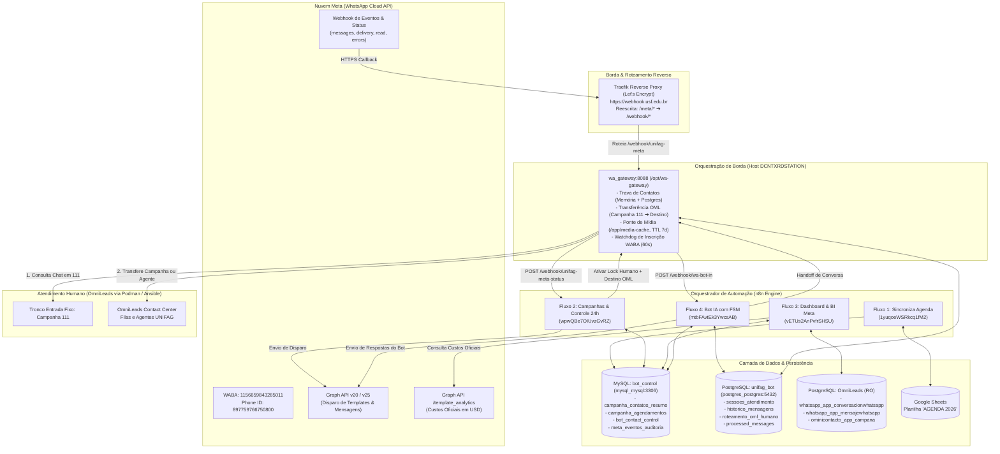
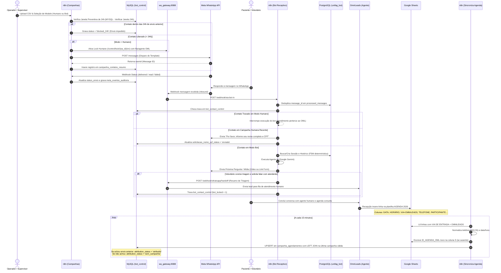

# Arquitetura Global do Sistema — UNIFAG

Este documento detalha a topologia de microsserviços, componentes de infraestrutura, barramentos de comunicação e o ciclo de vida ponta a ponta dos dados no ecossistema de automações WhatsApp da **UNIFAG**.

---

## 1. Topologia de Microsserviços e Integração

O ecossistema opera em uma arquitetura orientada a eventos e microsserviços conteinerizados, orquestrada pelo **n8n** e interligada à infraestrutura de telefonia e mensageria corporativa:

---

## 2. Componentes e Portas de Rede

| Componente | Endereço / Porta | Função no Ecossistema |
|---|---|---|
| **Traefik Reverse Proxy** | `https://webhook.usf.edu.br` (443) | Ponto único de entrada HTTPS seguro com certificado Let's Encrypt automático. Aplica reescrita de `/meta/(.*)` para `/webhook/$1`. |
| **`wa_gateway`** | `http://wa_gateway:8088` (`/opt/wa-gateway`) | Microsserviço Node.js orquestrado como serviço **Docker Swarm** (`node_meta_wa_gateway` na stack `node_meta`). Gerencia travas, cache de mídia (7d), watchdog WABA e transferência no OML. Veja o [**Guia Completo do Gateway**](gateway-orquestracao.md). |
| **n8n Workflow Engine** | Host / Porta configurada (padrão 5678) | Hospeda os webhooks, telas web interativas e regras de negócio de todos os fluxos. |
| **OmniLeads (OML 2.5.6)** | `https://oml.usf.edu.br` | Plataforma de Contact Center implantada via **Podman** (orquestrada por **Ansible**). Gerencia agentes humanos, campanhas e filas. |
| **MySQL (`bot_control`)** | `mysql_mysql:3306` | Banco relacional onde residem os resumos das campanhas, a tabela de agendamentos atribuídos, a auditoria de faturamento Meta e as travas de contato. |
| **PostgreSQL (`unifag_bot`)** | `postgres_postgres:5432` | Banco relacional do bot e gateway: sessões da FSM, histórico Q&A, deduplicação (`processed_messages`) e roteamento humano (`roteamento_oml_humano`). |
| **PostgreSQL OmniLeads** | Credencial `OML_Postgres_RO` (`5432`) | Banco analítico em leitura (RO) do OmniLeads para auditar tempo de resposta dos operadores e conversas sem atendimento. |
| **Google Sheets API** | OAuth2 / Google Cloud | Planilha colaborativa utilizada pela recepção médica e coordenação de estudos clínicos. |
| **Meta Graph API** | `https://graph.facebook.com/v20.0` e `v25.0` | API oficial da Meta para submissão de modelos, envio de mensagens e extração de métricas de cobrança (`template_analytics`). |

---

## 3. Ciclo de Vida Ponta a Ponta: Da Campanha à Conversão

O fluxo a seguir ilustra a jornada completa de um contato desde o disparo até o comparecimento na clínica:

---

## 4. Mecanismos de Proteção e Isolamento de Tráfego

Para garantir integridade operacional e segurança de dados, o ecossistema implementa três barreiras de proteção fundamentais:

### A. Prevenção Preventiva de Janela de 24 Horas (`blocked_24h`)
* **Problema evitado**: Reenvio acidental para contatos que já receberam mensagem nas últimas 24 horas, evitando custos desnecessários com a Meta e rejeições por política de frequência.
* **Mecanismo**: Antes de invocar a Meta Send API, o Fluxo 2 executa uma query analítica no MySQL verificando se existe registro para o mesmo telefone com `enviado_em >= NOW() - INTERVAL 24 HOUR`.
* **Ação**: Caso exista, o contato é inserido diretamente com `status_envio = 'blocked_24h'` e o loop pula o envio, salvando no campo de observação o ID da campanha anterior e o horário exato em que o contato será liberado.

### B. Trava de Colisão Bot vs. Humano (`bot_contact_control`)
* **Problema evitado**: O Bot de IA responder mensagens enquanto um operador humano do OmniLeads está em atendimento ativo com o paciente.
* **Mecanismo**:
  1. No disparo humano ou no momento do handoff, o `wa_gateway` e o MySQL registram `bot_locked = 1` com `source = 'agent'` e validade de 30 minutos renováveis por interação.
  2. No webhook de entrada (`wa-bot-in`), o nó `MYSQL - Check Bot Lock` valida a trava. Se `bot_locked = 1` e `updated_at >= NOW() - 30 MIN`, o fluxo encerra imediatamente no nó `BOT BLOQUEADO - STOP`.
  3. Sessões no PostgreSQL com `status = 'humano'` também desviam para o nó terminal `SESSÃO HUMANA - STOP`.

### C. Idempotência e Deduplicação de Mensagens (`processed_messages`)
* **Problema evitado**: Webhooks duplicados enviados pela Meta ou retentativas de rede gerando múltiplas respostas do bot para a mesma mensagem.
* **Mecanismo**: Toda mensagem recebida possui um `wamid` exclusivo. O nó `DB - Check Processed Message` consulta a tabela `unifag_bot.processed_messages`. Se já existir, a execução é descartada instantaneamente. Caso contrário, o ID é inserido e o processamento prossegue.
