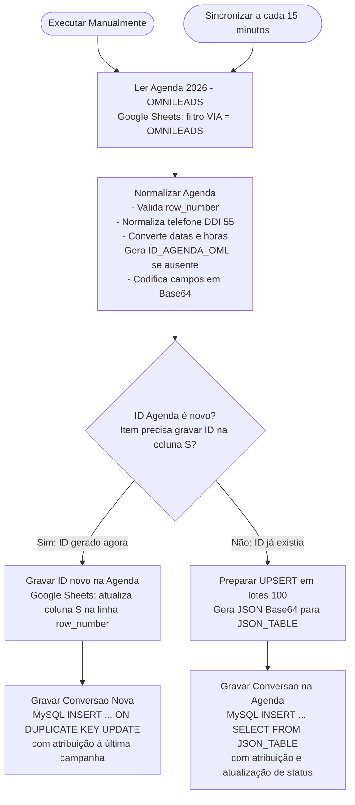

# Fluxo 01 — Sincroniza Agenda OML (Otimizado)

* **Nome do Fluxo**: `UNIFAG - Sincroniza Agenda OML - OTIMIZADO`
* **ID do Workflow**: `1yuqoeWSRkcq1fM2`
* **Periodicidade**: A cada 15 minutos (`Sincronizar a cada 15 minutos`) ou execução sob demanda (`Executar Manualmente`).
* **Credenciais Necessárias**:
  * `Google Sheets account` (`bcI4q6WDUYFaqRCW`)
  * `MySQL - bot_control` (`Douv0MMoaoiQSOUc`)

---

## 1. Objetivo de Negócio

Conectar a planilha operacional de consultas da clínica (**Google Sheets `AGENDA 2026`**) ao banco de dados relacional (**MySQL `bot_control`**), garantindo:
1. **Identidade Única e Imutável**: Criação de um identificador rastreável (`ID_AGENDA_OML`) para cada agendamento oriundo do OmniLeads que ainda não possua identificador, persistindo-o de volta na coluna S da planilha.
2. **Atribuição Automática de Conversão**: Cruzamento do agendamento com a última campanha de WhatsApp enviada para o paciente/voluntário antes da data da consulta.
3. **Acompanhamento de Desfecho**: Atualização contínua do comparecimento (`status_presenca = PRESENTE/AUSENTE`) e do parecer médico (`status_consulta = APTO/INAPTO`), viabilizando as métricas de conversão real no Dashboard executivo.

---

## 2. Diagrama de Execução do Fluxo



---

## 3. Nós e Componentes do Workflow

### 3.1. `Ler Agenda 2026 - OMNILEADS` (Google Sheets Node)
* **Planilha ID**: `1PhwJbwwvQQyYEgla2s8U_s8YgcPGFt2jd1c3vv4-9v4`
* **Aba**: `AGENDA 2026` (gid: `327726699`)
* **Filtro Aplicado**: `VIA DE ENTRADA = OMNILEADS`
* **Campos Extraídos**: `row_number`, `DATA`, `HORÁRIO`, `PART. PESQUISA`, `TELEFONE`, `MÉDICO`, `CONSULTA`, `COMO FICOU SABENDO`, `AGENDADO POR`, `STATUS PASTA PP`, `CONFIRMAÇÃO PRESENÇA`, `STATUS PRESENÇA`, `STATUS CONSULTA`, `ATENDIDO POR`, `OBSERVAÇÃO / NÚM. PROTOCOLO (CNSP)`, `ID_AGENDA_OML` (coluna S).

### 3.2. `Normalizar Agenda` (Code Node - JavaScript)
Executa a validação e padronização dos dados antes de qualquer escrita no banco:
* **Validação de Linha**: Exige `row_number` válido; caso contrário, interrompe a execução com erro crítico para evitar registros sem identidade física na planilha.
* **Normalização Telefônica**:
  * Remove todos os caracteres não numéricos.
  * Se possuir 10 ou 11 dígitos (DDD + número), adiciona o DDI nacional `55`.
* **Padronização de Datas e Horas**:
  * Converte formatos `DD/MM/YYYY` ou `YYYY-MM-DD` para `YYYY-MM-DD`.
  * Formata horário para `HH:MM:SS`.
* **Geração de ID Único**:
  * Caso a coluna `ID_AGENDA_OML` esteja vazia, gera o identificador no formato:
    ```
    AGENDA-{YYYYMMDDHHMMSSmmm}-{row_number_5d}-{index_3d}
    ```
    Exemplo: `AGENDA-20260930164220123-00045-001`.
  * Mantém um `Set` de validação para impedir duplicidades dentro do mesmo lote.
* **Prevenção de Injeção e Corrupção de Caracteres**:
  * Todos os campos textuais (`participante_nome`, `observacao`, `medico`, etc.) são codificados em **Base64** antes de serem interpolados na query SQL, sendo decodificados no MySQL via `CONVERT(FROM_BASE64(...) USING utf8mb4)`.

### 3.3. `ID Agenda é novo?` (IF Node)
* **Condição**: Avalia se a propriedade `ID_AGENDA_OML` foi anexada ao payload (o que indica que a linha na planilha precisa receber a nova chave gerada).

### 3.4. `Gravar ID novo na Agenda` (Google Sheets Update Node)
* Escreve o novo `ID_AGENDA_OML` gerado diretamente na coluna da planilha, casando pelo número da linha (`row_number`).

### 3.5. `Preparar UPSERT em lotes (100)` (Code Node - JavaScript)
* Quando os registros já possuem ID, agrupa os itens em blocos de até 100 agendamentos.
* Serializa o array em JSON, converte para Base64 e monta a consulta parametrizada via `JSON_TABLE()`.

---

## 4. Regras de Atribuição de Conversão (SQL Logic)

Tanto o nó de inserção individual (`Gravar Conversao Nova`) quanto o de lote (`Gravar Conversao na Agenda`) executam a correlação com a tabela `campanha_contatos_resumo` através da seguinte query:

```sql
LEFT JOIN campanha_contatos_resumo cc
  ON cc.id = (
    SELECT c2.id
    FROM campanha_contatos_resumo c2
    WHERE c2.wa_id = jt.wa_id
      AND c2.enviado_em IS NOT NULL
      AND c2.enviado_em <= NOW()
      AND c2.campaign_key IS NOT NULL
      AND TRIM(c2.campaign_key) <> ''
      AND c2.campaign_key <> 'campaign_key'
      AND c2.campaign_key NOT LIKE '%$json.campaign_key%'
      -- Exclui campanhas de serviço/lembrete que não caracterizam atração inicial:
      AND LOWER(TRIM(SUBSTRING_INDEX(c2.campaign_key, '__', -1))) NOT IN (
        'confirmacao_de_agenda_consulta',
        'ausente',
        'confirmacao_coleta_pos'
      )
    ORDER BY
      c2.enviado_em DESC,
      c2.id DESC
    LIMIT 1
  )
```

### Regras de Negócio da Atribuição:
1. **Atribuído (`atribuido`)**: Quando o paciente recebeu uma mensagem de campanha ativa antes da detecção do agendamento. O agendamento herda `campaign_key`, `campanha_nome`, `respondeu_cliente` e `attributed_at = NOW()`.
2. **Sem Campanha (`sem_campanha`)**: Quando o agendamento foi registrado sem que houvesse campanha prévia vinculada para aquele telefone (`attribution_method = 'sem_campanha_antes_deteccao_agenda'`).
3. **Idempotência no `ON DUPLICATE KEY UPDATE`**:
   * Atualiza dados médicos, data da consulta e comparecimento (`status_presenca`, `status_consulta`).
   * **Não sobrescreve** a atribuição original já consolidada.
   * Atualiza `last_seen_at = CURRENT_TIMESTAMP`.
