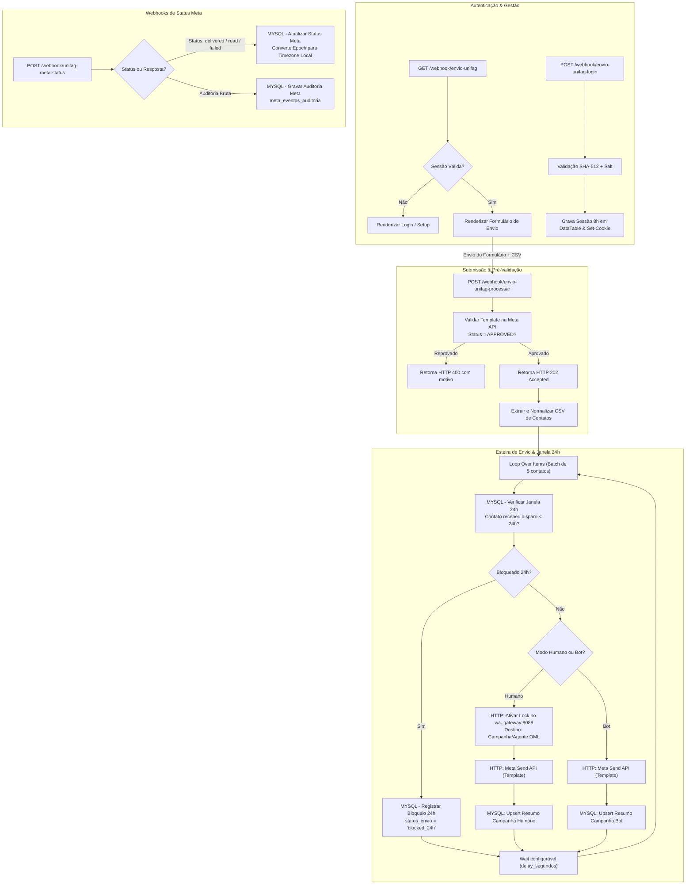

# Fluxo 02 — Campanhas WhatsApp & Controle 24h

* **Nome do Fluxo**: `UNIFAG - Campanhas WhatsApp - Controle 24h e Relatórios`
* **ID do Workflow**: `wpwQBe7OIUvzGvRZ`
* **Portais Web Expostos**:
  * Formulario de Disparo: `/webhook/envio-unifag`
  * Processamento de Envio: `/webhook/envio-unifag-processar`
  * Gestão de Usuários: `/webhook/envio-unifag-admin`
  * Gestão de Modelos Meta: `/webhook/envio-unifag-templates`
  * Webhook de Status da Meta: `/webhook/unifag-meta-status`
* **Credenciais Necessárias**:
  * `Meta WhatsApp Cloud API Token` (`facebookGraphApi` / Bearer token)
  * `MySQL - bot_control` (`Douv0MMoaoiQSOUc`)
  * `n8n DataTable` (`wa_automation_config`)

---

## 1. Objetivo de Negócio

Prover uma plataforma unificada e corporativa para envio de mensagens ativas pelo WhatsApp, garantindo:
1. **Controle de Acesso com RBAC**: Autenticação com sessão segura de 8 horas, perfis de Operador, Supervisor e Administrador, e obrigatoriedade de troca de senha no primeiro acesso.
2. **Conformidade com a Meta**: Catálogo de templates sincronizado via API, validação estrita de variáveis em linha única (`{{1}}`, `{{2}}` sem quebras de linha em parâmetros) e verificação prévia de aprovação antes do disparo.
3. **Proteção Preventiva de Janela de 24h**: Bloqueio prévio de contatos que já receberam disparos recentes, salvando-os como `blocked_24h` para evitar cobranças indevidas e desgaste do número.
4. **Roteamento Inteligente**:
   * **Modo Humano**: Integração com OmniLeads através do `wa_gateway`, travando o bot e encaminhando a resposta do voluntário para a fila ou agente selecionado.
   * **Modo Bot**: Disparo automático com atendimento receptivo pelo Bot inteligente.
5. **Auditoria de Entrega e Faturamento**: Recebimento de webhooks de status da Meta (`sent`, `delivered`, `read`, `failed`) e gravação detalhada de custos e erros em `meta_eventos_auditoria`.

---

## 2. Diagrama da Arquitetura do Fluxo



---

## 3. Estrutura dos Módulos Web e Endpoints

### 3.1. Painel de Disparo (`/webhook/envio-unifag`)
* **Verificação de Sessão**: Inspeciona o cookie `unifag_envio_session` ou o campo `session_token`.
* **Roteamento Dinâmico OML**:
  * Consome `/webhook/unifag-oml-campaigns` e `/webhook/unifag-oml-agents` (proxies para o `wa_gateway`).
  * No modo humano, obriga a seleção de uma campanha OML de destino (impedindo a campanha fixa de entrada `111`).
* **Pré-visualização de Variáveis**:
  * Valida em tempo real no navegador se parâmetros contêm quebras de linha ou tabulações (proibidas pela Meta em valores dinâmicos).
* **Arquivo CSV**: Exige cabeçalho com coluna `telefone` (validação case-insensitive).

### 3.2. Gestão de Modelos Meta (`/webhook/envio-unifag-templates`)
* **Sincronização Contínua**: Endpoint `/webhook/envio-unifag-templates-sync` atualiza o catálogo local com o Graph API a cada 60 segundos enquanto a aba estiver aberta.
* **Cadastro de Modelos**: Permite criar novos templates de Marketing ou Utilidade diretamente pelo painel e submetê-los para aprovação na Meta com componentes de exemplo.

### 3.3. Administração de Usuários (`/webhook/envio-unifag-admin`)
* **Perfis (RBAC)**:
  * **Operador (`user`)**: Dispara campanhas e visualiza o formulário.
  * **Supervisor (`supervisor`)**: Dispara campanhas e gerencia templates Meta.
  * **Administrador (`admin`)**: Acesso total, incluindo cadastro e inativação de usuários.
* **Segurança de Credenciais**:
  * Senha provisória gerada no cadastro com flag `must_change_password = true`.
  * Hash calculado com `SHA-512(salt + ":" + senha_plana)`.
  * Troca de perfil incrementa `session_version`, invalidando sessões anteriores ativas.

---

## 4. Esteira de Envio e Verificação da Janela de 24h

A proteção contra reenvios em menos de 24 horas é executada nó a nó pelo nó **`MYSQL - Verificar Janela 24h`**:

```sql
WITH entrada AS (
  SELECT
    $1 AS campaign_key, $2 AS wa_id, $3 AS modo_disparo,
    $4 AS template_label, $5 AS template_name, $6 AS template_language_code,
    $7 AS message_text, $8 AS texto_personalizado, $9 AS indice_destinatario,
    $10 AS total_destinatarios, $11 AS config_phone_number_id,
    $12 AS config_delay_segundos, $13 AS config_lock_expiration_minutes
),
contato_atual AS (
  SELECT e.*,
    CASE
      WHEN REGEXP_REPLACE(COALESCE(e.wa_id, ''), '[^0-9]', '') REGEXP '^55[0-9]{10,11}$'
      THEN SUBSTRING(REGEXP_REPLACE(e.wa_id, '[^0-9]', ''), 3)
      ELSE REGEXP_REPLACE(COALESCE(e.wa_id, ''), '[^0-9]', '')
    END AS telefone_normalizado
  FROM entrada e
),
ultimo_envio AS (
  SELECT c.id, c.campaign_key, c.enviado_em
  FROM campanha_contatos_resumo c
  CROSS JOIN contato_atual a
  WHERE a.telefone_normalizado <> ''
    AND c.meta_message_id IS NOT NULL
    AND c.enviado_em IS NOT NULL
    AND c.enviado_em >= NOW() - INTERVAL 24 HOUR
    AND c.enviado_em <= NOW()
    AND (
      CASE
        WHEN REGEXP_REPLACE(COALESCE(c.wa_id, ''), '[^0-9]', '') REGEXP '^55[0-9]{10,11}$'
        THEN SUBSTRING(REGEXP_REPLACE(c.wa_id, '[^0-9]', ''), 3)
        ELSE REGEXP_REPLACE(COALESCE(c.wa_id, ''), '[^0-9]', '')
      END
    ) = a.telefone_normalizado
  ORDER BY c.enviado_em DESC, c.id DESC
  LIMIT 1
)
SELECT
  a.*,
  CASE WHEN u.id IS NOT NULL THEN 1 ELSE 0 END AS bloqueado_24h,
  u.campaign_key AS campanha_anterior_key,
  u.enviado_em AS ultimo_envio_em,
  CASE WHEN u.id IS NOT NULL THEN DATE_ADD(u.enviado_em, INTERVAL 24 HOUR) ELSE NULL END AS liberado_em
FROM contato_atual a
LEFT JOIN ultimo_envio u ON TRUE;
```

### Decisão e Ações do Loop:
* **Se `bloqueado_24h = 1`**: O nó `MYSQL - Registrar Bloqueio 24h` grava a linha em `campanha_contatos_resumo` com `status_envio = 'blocked_24h'` e observação contendo `campanha_anterior`, `ultimo_envio_em` e `liberado_em`. A chamada HTTP para a Meta é **completamente evitada**.
* **Se `bloqueado_24h = 0`**:
  * **Modo Humano**:
    1. O nó `HTTP - Ativar Lock Humano Campanha` notifica o serviço `wa_gateway:8088` (`/opt/wa-gateway/index.js` no host `DCNTXRDSTATION` via rede `network_public`):
       ```http
       POST http://wa_gateway:8088/control/lock/{wa_id}/on
       Content-Type: application/json

       {
         "destination_type": "campaign",
         "oml_campaign_id": 115,
         "oml_campaign_name": "Fila_Geral_Pesquisa",
         "oml_agent_id": null,
         "oml_agent_name": null,
         "campaign_key": "20261002_0900__unifag_pesquisa",
         "campanha_nome": "Campanha Voluntarios Outubro",
         "template": "unifag_pesquisa"
       }
       ```
    2. O `wa_gateway` realiza o *upsert* na tabela PostgreSQL `unifag_bot.roteamento_oml_humano` (`routed = FALSE`) e ativa a trava em `bot_contact_control` (`source = 'n8n_mass_human'`).
    3. Quando o paciente responder à mensagem, a conversa ingressará pelo Tronco padrão do OmniLeads (Tronco `111` - `UNIFAG_WHATSAPPV1`). O `wa_gateway` intercepta o evento, recupera as diretrizes em `unifag_bot.roteamento_oml_humano` e aciona a transferência automática via API do OmniLeads (`/api/v1/whatsapp/transfer/to_campaign/` ou `/transfer/to_agent/`), marcando `routed = TRUE`.
    4. Paralelamente, no Fluxo 4, se for a primeira resposta, o sistema envia o prompt de identificação (`HUMAN_CAMPAIGN_PROMPT_V1`: *"Por favor, informe seu nome completo e CPF para prosseguirmos com seu atendimento."*), assegurando que o operador humano já receba os dados no chat do OML sem retardar a fila.
    5. O nó seguinte despacha a mensagem via Meta Graph API (`POST /messages`) e insere o registro em `campanha_contatos_resumo`.
  * **Modo Bot**: Dispara diretamente via Meta Graph API (`POST /messages`) e grava em `campanha_contatos_resumo`. O atendimento receptivo posterior será conduzido integralmente pelo Robô de IA (Fluxo 4).
  * Após o envio, o nó `Wait` aplica uma pausa de `delay_segundos` (lido da DataTable `wa_automation_config`) para controle de cadência de tráfego.

---

## 5. Webhook de Status da Meta (`/webhook/unifag-meta-status`)

A Meta envia eventos de callback assíncronos que são tratados em dois ramos concorrentes:

### Ramo 1: Atualização Operacional (`Code - Preparar Status Meta`)
* **Timezone Seguro**: A Meta envia o timestamp UNIX UTC. O nó utiliza `FROM_UNIXTIME(epoch)` diretamente no MySQL (`America/Sao_Paulo` -03:00) para evitar desvios de fuso horário.
* **Progressão de Estados**:
  * `sent` -> `delivered` (marca `entregue = 1` e salva `entregue_em`) -> `read` (marca `lida = 1`).
  * `failed`: salva `status_envio = 'failed'` e concatena o código, título e detalhes de erro no campo `observacoes`.
* **Respostas do Cliente (`human_campaign_reply`)**:
  * Identifica a resposta humana ao disparo ativo das últimas 7 semanas.
  * Atualiza `respondeu_cliente = 1`, `primeira_mensagem_cliente`, `ultima_mensagem_cliente` e incrementa `quantidade_interacoes`.

### Ramo 2: Trilha de Auditoria (`Code - Preparar Auditoria Meta`)
* Insere registro detalhado na tabela `meta_eventos_auditoria`.
* Grava informações de tarifação (`pricing_billable`, `pricing_category`, `pricing_model`), janela da conversa (`conversation_id`, `conversation_origin_type`, expiração) e o payload bruto em formato JSON.
