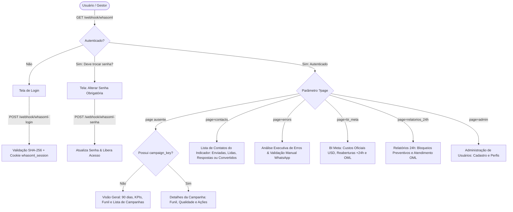

# Fluxo 03 — Dashboard Original, Relatórios 24h & BI Meta

* **Nome do Fluxo**: `UNIFAG - Dashboard Original + Relatórios 24h V5`
* **ID do Workflow**: `vETUs2AnPvfrSHSU`
* **Portal Web Exposto**: `/webhook/whasoml` (Métodos `GET` e `POST`)
* **Credenciais Necessárias**:
  * `MySQL - bot_control` (`Douv0MMoaoiQSOUc`)
  * `Postgres - OML_Postgres_RO` (`2bKvTQOQHDE6NZCM`)
  * `Facebook Graph API` (`f3FBVs4cvPmGqdQD` / WABA ID `1156659843285011`)
  * `n8n DataTable` (`dashboard_usuarios`)

---

## 1. Objetivo de Negócio

Oferecer à diretoria, coordenação clínica e supervisão operacional uma central analítica completa para acompanhamento de campanhas, custos oficiais da Meta, integridade da proteção de 24 horas e eficiência do atendimento humano no OmniLeads:
1. **Funil Completo de Conversão**: Rastreamento da jornada ponta a ponta: *Enviadas -> Entregues -> Lidas -> Respostas -> Convertidos -> Agendamentos -> Presentes -> Aptos*.
2. **BI de Custos Oficiais Meta**: Conexão direta com a API `template_analytics` da Meta (v25.0) para leitura de custos reais em **USD** (moeda da WABA UNIFAG), sem tarifas fixas artificiais, com cache de performance de 5 minutos.
3. **Auditoria da Janela de 24 Horas**: Identificação precisa de reaberturas pagas confirmadas (`REABERTURA_PAGA_CONFIRMADA` com `pricing_billable=1` após +24h), separadas da estimativa histórica V7.
4. **Auditoria de Atendimento OmniLeads**: Monitoramento de conversas recebidas vs. conversas encerradas, tempo de resposta dos agentes humanos e taxa de conversas perdidas/expiradas sem atendimento.
5. **Gestão Operacional de Falhas & Bloqueios**: Detalhamento amigável de erros Meta com ferramenta administrativa para validação e saneamento de números sem WhatsApp (código 131026).

---

## 2. Mapa de Rotas e Páginas do Dashboard

---

## 3. Módulos e Funcionalidades Detalhadas

### 3.1. Visão Geral (`#overview` e `#campaigns`)
* **Janela Temporal**: Analisa automaticamente os últimos 90 dias (`WHERE c.enviado_em >= NOW() - INTERVAL 90 DAY`).
* **KPIs Globais**: Mensagens Enviadas, Entregues, Respostas, Convertidos, Agendamentos, Presentes, Aptos e Erros.
* **Gráfico de Barras**: Exibe o comparativo de Entregas vs. Leituras para os 8 maiores volumes de envio.
* **Gráfico Donut**: Taxa percentual de entrega consolidada (`Entregues ÷ Enviadas`).
* **Tabela de Campanhas com Indicador de Saúde**:
  * **Saudável (`good`)**: Taxa de erro ≤ 10% e entrega ≥ 70%.
  * **Atenção (`warn`)**: Entrega < 70%.
  * **Crítico (`bad`)**: Taxa de erro > 10%.

---

### 3.2. Detalhes da Campanha Individual (`?campaign_key=...`)
* **Funil de Conversão**: Representação visual da progressão dos voluntários da campanha até a consulta médica.
* **Métricas da Agenda Médica**:
  * **Convertidos**: Contatos únicos (`COUNT(DISTINCT wa_id)`) atribuídos à campanha.
  * **Agendamentos**: Linhas totais geradas na planilha.
  * **Presentes**: Pacientes com `status_presenca = 'PRESENTE'` (% sobre convertidos).
  * **Aptos**: Pacientes com `status_consulta = 'APTO'` (% sobre convertidos).
* **Exportação para PDF**: Layout otimizado com `@media print` e `@page { size: A4 landscape; margin: 10mm; }` para geração de relatórios formais.
* **Exclusão Segura (Admin Only)**: Formulário com confirmação de palavra-chave (`EXCLUIR`) via rota `POST /webhook/whasoml-campanha-excluir`.

---

### 3.3. Lista de Contatos por Indicador (`?page=contacts&metric=...`)
Permite inspecionar a lista nominal de pessoas em cada etapa:
* **Métricas de Comunicação (`sent`, `delivered`, `read`, `replied`)**:
  * Exibe telefone formatado, modo de disparo (Humano/Bot), texto da mensagem e datas.
  * No indicador **`replied`**, analisa automaticamente a **intenção da mensagem** do paciente através de expressões regulares:
    * `Agendamento` (ex: agendar, reagendar, consulta, horário).
    * `Interessado` (ex: tenho interesse, quero saber, mais informações).
    * `Sem interesse` (ex: não quero, pare, remover).
    * `Conversa iniciada` (ex: oi, olá, bom dia).
* **Métricas da Agenda (`converted`, `appointments`, `present`, `apt`)**:
  * Exibe nome do participante, data e horário agendados, médico, tipo de consulta e parecer clínico.
  * Paginação nativa de 50 contatos por página com filtro instantâneo por busca textual.

---

### 3.4. Análise de Erros & Validação WhatsApp (`?page=errors`)
Transforma retornos técnicos crípticos da Meta em categorias operacionais claras:

| Categoria | Códigos de Erro Mapeados | Ação Recomendada |
|---|---|---|
| **Contato** | `131026` | O número pode não possuir WhatsApp ativo. Exige validação prévia. |
| **Limites da Meta** | `131049`, `131048`, `130429` | Limite de frequência ou engajamento atingido. Aguardar 24h antes de reenvio. |
| **Atendimento** | `131047` | Janela de 24h expirada. Enviar template aprovado para reabrir conversa. |
| **Templates** | `132000`, `132001`, `132005` | Parâmetros incompletos, template não localizado ou pausado pela Meta. |
| **Crítico** | `190`, `131031` | Token de autenticação expirado ou conta bloqueada. Acionar TI imediatamente. |

#### Validação Manual de Números (Ação de Higienização de Base):
No caso do erro `131026`, administradores possuem botões rápidos para classificar o número:
* `Confirmar sem WhatsApp`: Marca `whatsapp_validacao_status = 'confirmado_sem_whatsapp'`.
* `Confirmar WhatsApp ativo`: Marca `whatsapp_validacao_status = 'whatsapp_ativo'`.
* `Remover confirmação`: Retorna para `nao_validado`.

---

### 3.5. Módulo BI Meta & Janela de 24h (`?page=bi_meta`)

Integração de inteligência financeira e custos reais:

#### A. Consulta Direta ao `template_analytics` da Meta:
* Executa requisição para `https://graph.facebook.com/v25.0/1156659843285011/template_analytics`.
* Consulta em lotes de no máximo 10 templates (limite da API Meta) e extrai `amount_spent` e `cost_per_delivered`.
* **Sem Tarifas Fictícias**: Caso a Meta não retorne custo para um template, o valor é exibido como `—` (indisponível), sem aplicar estimativas estáticas inventadas.
* **Cache em Memória de 5 Minutos (`TTL_MS = 300000`)**: Armazena as respostas no static data global do n8n para garantir carregamento instantâneo do dashboard e prevenir bloqueios por taxa de requisição (*rate limiting*).

#### B. Auditoria das Reaberturas após 24 Horas:
* Baseia-se na view `vw_meta_janela_24h`.
* Considera **Reabertura Paga Confirmada** exclusivamente mensagens com:
  1. `horas_desde_interacao > 24` em relação ao último inbound auditado.
  2. `pricing_billable = 1` confirmado no webhook da Meta.
* Mensagens sem inbound anterior auditado ou enviadas dentro de 24h com cobrança são isoladas e não são infladas como reaberturas.
* **Histórico Estimado V7**: Para envios legados anteriores à ativação da auditoria Meta, o painel preserva a heurística histórica V7 em cartões separados, sem misturar dados auditados com dados estimados.

#### C. Cruzamento de Atendimento com o OmniLeads:
* Conecta-se via PostgreSQL (`OML_Postgres_RO`) à base do OmniLeads:
  * **Contatos Recebidos**: Filtrados pela data do último inbound do cliente (`ultimo_cliente_em`).
  * **Conversas Encerradas**: Filtradas pela data de qualificação (`fechado_em`).
  * **Atendidas pelo Agente**: Mensagens outbound enviadas por operador humano (`mo.sender->>'agent_id' IS NOT NULL`).
  * **Sem Atendimento após 24h**: Conversas encerradas sem resposta humana após o prazo de expiração da janela (`fechado_em > expire`).
  * **Exportação CSV Direta**: Botões com download imediato de relatórios de contatos perdidos/não atendidos.
