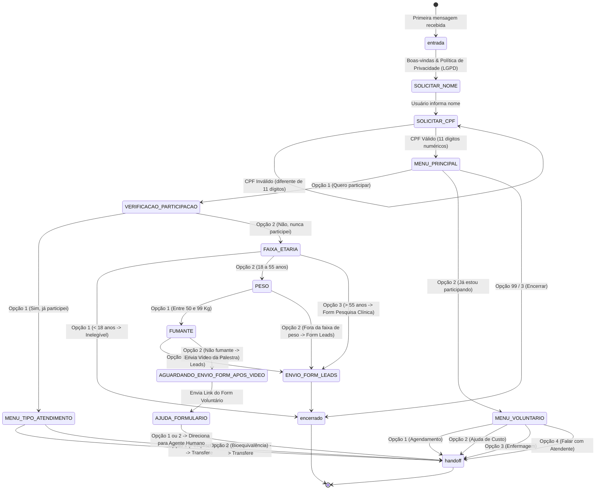
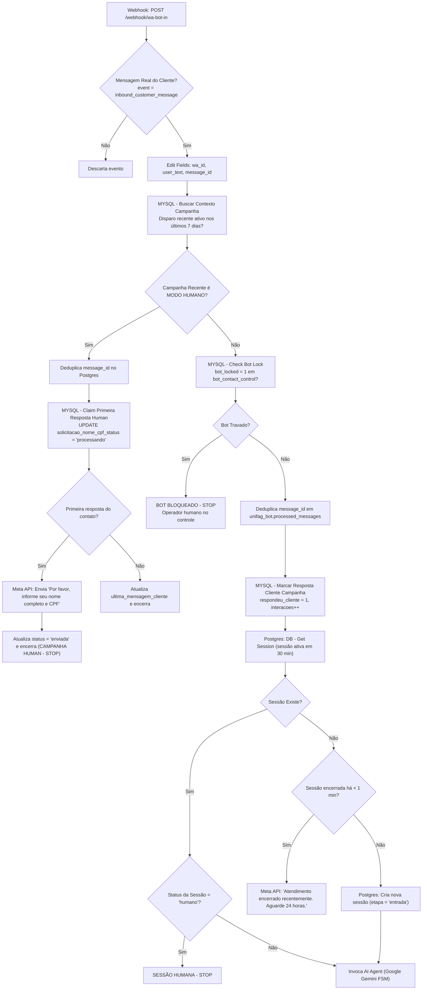

# Fluxo 04 — Bot Inteligente com Registro de Respostas

* **Nome do Fluxo**: `UNIFAG - Bot com Registro de Respostas da Campanha`
* **ID do Workflow**: `mtbFAvtEk3YwcsAB`
* **Webhook de Entrada**: `/webhook/wa-bot-in` (Método `POST`)
* **Modelo de IA Utilizado**: `Google Gemini Chat Model` via LangChain (`@n8n/n8n-nodes-langchain.agent`)
* **Credenciais Necessárias**:
  * `Google Gemini API Key` (`lWU9Xli8TsieQxOx`)
  * `PostgreSQL - Unifag_Bot` (`RLZJxPIN5hWeeHIB`)
  * `MySQL - bot_control` (`Douv0MMoaoiQSOUc`)
  * `Meta WhatsApp Cloud API Token` (`facebookGraphApi` / Bearer token)

---

## 1. Objetivo de Negócio

Disponibilizar atendimento inteligente, 24 horas por dia e 7 dias por semana, para responder aos contatos que interagem após o recebimento de campanhas ou que enviam mensagens espontâneas para a linha institucional da UNIFAG:
1. **Triagem Determinística para Pesquisa Clínica**: Qualificação de novos voluntários através de uma **Máquina de Estados Finita (FSM)** rígida, validando idade (18 a 55 anos), peso (50 a 99 kg), histórico de tabagismo e participação prévia.
2. **Distribuição Assertiva de Mídias e Formulários**:
   * Envio automático do vídeo institucional explicativo da palestra de voluntários (`palestra_voluntarios_16mb.mp4`).
   * Envio do formulário oficial de cadastro de voluntários ou formulário de captação de leads.
3. **Prevenção de Colisão com Atendimento Humano**: Trava imediata do bot (`bot_locked = 1`) caso o contato esteja em atendimento com um operador do OmniLeads ou venha de um disparo recente configurado como campanha humana.
4. **Handoff Transparente para o OmniLeads**: Compilação de todo o histórico de perguntas e respostas da triagem em um resumo estruturado e envio para a fila do OML (`/webhook/whatsapp/handoff`).
5. **Retroalimentação de Métricas**: Atualização em tempo real da tabela `campanha_contatos_resumo`, marcando `respondeu_cliente = 1`, o texto do cliente e o texto respondido pelo Bot.

---

## 2. Diagrama de Transição de Estados da FSM (Triagem de Voluntários)

O Agente de IA opera estritamente como uma máquina de estados finita determinística, guiado pelo campo `etapa_atual`:



---

## 3. Esteira de Ingestão e Proteções Pré-Agente

Antes que o modelo de linguagem Gemini processe qualquer mensagem, o fluxo executa 5 validações críticas de segurança:



### 3.1. Detalhamento das Camadas de Proteção

1. **Validação de Inbound Real**:
   * O nó `Check - Mensagem Cliente` rejeita imediatamente callbacks de status (`sent`, `delivered`, `read`), confirmações de envio do próprio bot ou eco de mensagens enviadas pela plataforma.
2. **Tratamento de Campanha Humana (`HUMAN_CAMPAIGN_PROMPT_V1`)**:
   * Se o contato recebeu um disparo no modo humano nos últimos 7 dias, o bot IA **não é acionado**.
   * O nó `MYSQL - Claim Primeira Resposta Human` realiza um lock atômico definindo `solicitacao_nome_cpf_status = 'processando'`.
   * Na primeira resposta do contato, o sistema dispara via Meta API a solicitação padrão:  
     `"Por favor, informe seu nome completo e seu CPF para que possamos localizar seu cadastro e dar andamento ao seu atendimento."`
   * Em seguida, o status é alterado para `'enviada'`. O `wa_gateway` executa a transferência transparente da conversa no OmniLeads (Tronco `111` ➔ Fila/Agente de destino configurado em `unifag_bot.roteamento_oml_humano`).
   * As mensagens subsequentes apenas atualizam `ultima_mensagem_cliente` e são entregues diretamente no chat do operador humano no OML.
3. **Verificação de Trava Ativa (`bot_contact_control`)**:
   * O nó `MYSQL - Check Bot Lock` verifica se `bot_locked = 1` com `updated_at >= NOW() - INTERVAL 30 MINUTE`.
   * Se o operador humano já estiver em atendimento (ou se o lock foi emitido via `wa_gateway`), o bot silencia imediatamente, evitando respostas duplicadas ou invasão do diálogo.
   * O lock pode ser liberado automaticamente por timeout (30 min) ou explicitamente via `POST /control/lock/{wa_id}/off` disparado pelo gateway ao final da interação humana.
4. **Deduplicação Idempotente (`unifag_bot.processed_messages`)**:
   * A Meta pode reenviar o mesmo webhook até 3 vezes em caso de lentidão temporária. A checagem atômica de `message_id` impede qualquer processamento duplo.
5. **Bloqueio Anti-Loop de Encerramento Recente**:
   * Se o contato encerrou uma sessão há menos de 60 segundos, o robô não reabre nova sessão imediatamente; envia uma notificação padrão orientando a aguardar, prevenindo loops de encerramento em cascata.

---

## 4. O Agente de IA e Actions Permitidas

O nó `AI Agent` recebe via LangChain o estado corrente formatado em JSON:

```json
{
  "etapa_atual": "FAIXA_ETARIA",
  "nome_contato": "Eduardo Souza",
  "telefone": "5511974605594",
  "mensagem_usuario": "2"
}
```

E deve responder **obrigatoriamente** no esquema rígido:

```json
{
  "say": "Seu peso está entre 50 e 99 Kg?\n\n1 - Sim\n2 - Não",
  "etapa": "PESO",
  "handoff": {
    "to_human": false,
    "reason": ""
  },
  "action": {
    "type": "none",
    "payload": {}
  }
}
```

### Tipos de `action` Reconhecidas pelo Workflow:
1. **`none`**: Envio de mensagem de texto simples e navegação de estado.
2. **`send_video`**: Disparo do vídeo mp4 da palestra explicativa hospedado no bucket (`https://videos.automatizeonline.com.br/palestra_voluntarios_16mb.mp4`) com o texto de `say` como legenda.
3. **`send_form_leads`**: Disparo do link oficial do formulário de triagem de leads e transição para o estado `encerrado`.
4. **`send_form_voluntario`**: Disparo do link de cadastro de voluntário após o vídeo e transição para `AJUDA_FORMULARIO`.

---

## 5. Mecanismo de Handoff para o OmniLeads

Quando a triagem é concluída ou o voluntário seleciona uma opção humana, o fluxo executa a passagem de bastão de forma atômica:

1. **Compilação de Histórico (`DB - Update Session Stage2`)**:
   * O contexto da sessão no PostgreSQL compila o array `historico_qa` registrando cada etapa, pergunta realizada e resposta fornecida.
2. **Notificação ao Gateway (`HTTP Request - OML Handoff`)**:
   * Envia requisição `POST http://wa_gateway:8088/webhook/whatsapp/handoff` com cabeçalho de autenticação `X-Handoff-Secret: usf_verify_2026`.
   * Monta o resumo estruturado:
     ```
     Resumo da triagem do bot:
     1. Etapa: SOLICITAR_NOME
     Resposta: Eduardo Souza

     2. Etapa: SOLICITAR_CPF
     Resposta: 11111111111

     3. Etapa: MENU_PRINCIPAL
     Resposta: 2

     Motivo do handoff: atendente_humano
     ```
3. **Trava no MySQL (`MYSQL - Set Human Lock`)**:
   * Insere ou atualiza `bot_contact_control` definindo `bot_locked = 1`, `source = 'agent'` e `session_status = 'human'`.
4. **Persistência de Relatório**:
   * O nó `MYSQL - Upsert Atendimento Resumo` armazena o consolidado em texto na tabela `bot_atendimento_resumo`.
   * O nó `MYSQL - Upsert Atendimento Historico` decompõe o histórico em linhas individuais por pergunta/resposta em `bot_atendimento_historico`.
