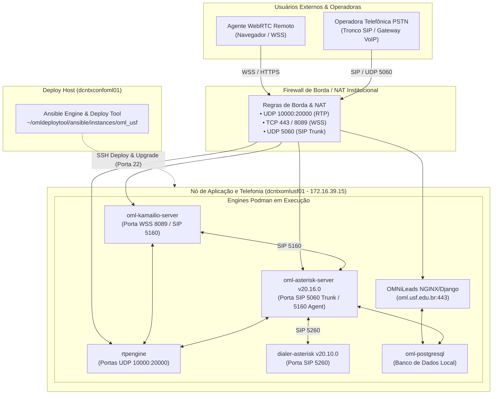
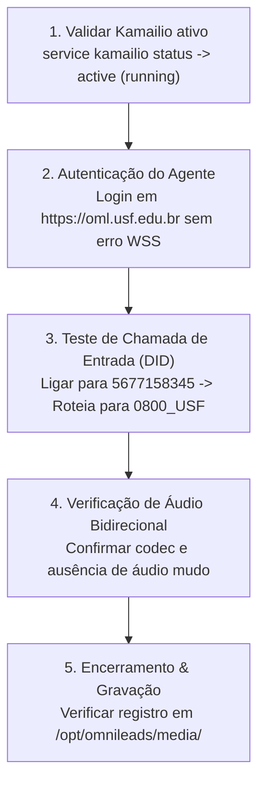

# Guia de Implantação, Manutenção e Configuração do OMNiLeads (USF)

Este documento estabelece as diretrizes e os procedimentos operacionais passo a passo para a **implantação**, **atualização**, **manutenção preventiva/corretiva** e **configuração técnica** da plataforma de contact center e telefonia IP **OMNiLeads** na infraestrutura da **USF** (*Universidade São Francisco*), operando sob o FQDN [`oml.usf.edu.br`](https://oml.usf.edu.br), em total consonância com as especificações da documentação oficial do fabricante e padrões de arquitetura corporativa.

---

## Sumário Executivo

```
docs/operacao/guia-implantacao-omnileads-usf.md
├── 1. Pré-requisitos e Arquitetura do Ambiente (Matriz de Servidores e Rede)
│   ├── 1.1 Matriz de Servidores e Papéis
│   ├── 1.2 Regras de Firewall e Intervalo de Portas (Mídia e Sinalização)
│   └── 1.3 Topologia Integrada de Rede e Telefonia
├── 2. Arquitetura Multi-Tenant e Parametrização (inventory.yml)
│   ├── 2.1 Estrutura de Diretórios de Instâncias
│   ├── 2.2 Função dos Ficheiros do Tenant (oml_usf)
│   ├── 2.3 Parâmetros de Autenticação Ansible
│   ├── 2.4 Ambiente Geral de Rede (infra_env: hybrid)
│   ├── 2.5 Ajuste Obrigatório para Certificados Customizados (TLS/SSL)
│   └── 2.6 Definição de IP Público NAT para Agentes Externos
├── 3. Execução de Atualização (Upgrade e Versionamento Git)
│   ├── 3.1 Verificação de Tags Estáveis via Git
│   └── 3.2 Execução do Script de Upgrade da Instância
├── 4. Manutenção e Limpeza do Motor de Telefonia (asterisk_clean)
│   ├── 4.1 Casos de Uso e Justificativas Operacionais
│   ├── 4.2 Execução Orquestrada via Deploy Tool (Nó de Deploy)
│   └── 4.3 Limpeza Operacional e Desconexão Forçada via CLI Asterisk
├── 5. Verificação de Serviços de Telefonia (Kamailio / SIP Proxy)
├── 6. Configuração da Console Web OMNiLeads
│   ├── 6.1 Criação de Campanha Manual e Mapeamento de Base de Dados
│   ├── 6.2 Configuração de Grupo de Agentes e Permissões
│   └── 6.3 Configuração de Rota de Entrada Telefônica (DID)
├── 7. Roteiro de Validação e Testes de Homologação
├── 8. Parâmetros Técnicos de Kernel, Limites do SO e Motores Asterisk
│   ├── 8.1 Parâmetros de Kernel Linux (sysctl)
│   ├── 8.2 Limites de Recursos do Sistema (ulimit)
│   ├── 8.3 Comparativo de Motores: Asterisk Principal vs. Discador
│   └── 8.4 Transportes SIP e Mapeamento de Portas
├── 9. Matriz de Resolução de Problemas (Troubleshooting)
└── 10. Políticas Oficiais de Backup, Segurança e Salvaguardas
    ├── 10.1 Backup de Volume de Gravações de Áudio (/opt/omnileads/media/)
    ├── 10.2 Backup Lógico do PostgreSQL (oml-postgresql)
    └── 10.3 Backup de Configuração da Instância Ansible
```

---

## 1. Pré-requisitos e Arquitetura do Ambiente (Matriz de Servidores e Rede)

Antes de iniciar qualquer procedimento de manutenção, upgrade ou alteração de topologia, a equipe de engenharia e operações deve compreender a estrita separação de papéis entre os servidores do cluster, garantir a liberação prévia de portas de firewall e validar os acessos administrativos SSH.

### 1.1 Matriz de Servidores e Papéis

| Servidor / Papel | Hostname / IP | Descrição e Função na Infraestrutura | Acesso / Credenciais |
|---|---|---|---|
| **Servidor de Deploy** (*Deploy Host*) | `dcntxconfoml01` | Nó central de controle Ansible. Aloja o repositório `~/omldeploytool/ansible/instances/oml_usf` e orquestra atualizações, receitas e deploys para todo o cluster. | `root` (Porta SSH 22) |
| **Nó de Telefonia e Aplicação** | `dcntxomlusf01`<br>`(172.16.39.15)` | Servidor de execução onde a engine do Podman executa os containers de telefonia e serviços em tempo real (`oml-asterisk-server`, `dialer-asterisk`, `oml-kamailio-server`, `rtpengine`, `oml-postgresql`). | `root` (Porta SSH 22) |
| **Domínio de Serviço** (*FQDN*) | `oml.usf.edu.br` | Endereço oficial e público para acesso à console web administrativa/agente e ponto de terminação de sinalização WebSockets Seguro (WSS). | Porta HTTPS 443 / WSS 8089 |

> [!IMPORTANT]
> **Segregação de Funções**: Nenhuma receita do Ansible ou comando de upgrade deve ser executado a partir do nó `dcntxomlusf01`. O controle do ciclo de vida dos containers é estritamente centralizado no `dcntxconfoml01`.

---

### 1.2 Regras de Firewall e Intervalo de Portas (Mídia e Sinalização)

Conforme a especificação do fabricante OMNiLeads e as boas práticas de VoIP/WebRTC, o firewall de borda e as ACLs internas devem conter as seguintes regras expressas:

| Porta / Intervalo | Protocolo | Origem / Destino | Função e Justificativa Técnica |
|---|---|---|---|
| **`10000:20000`** | **UDP** | Agentes / Troncos ↔ **RTPEngine** | **Intervalo Oficial de Mídia RTP/SRTP**: Tráfego de áudio bidirecional de chamadas. Se bloqueado ou submetido a NAT assimétrico, causa queda imediata ou sintoma clássico de áudio unidirecional / mudo. |
| **`8089` / `443`** | **TCP / WSS** | Navegadores Agentes → **Kamailio / Web** | Sinalização WebSockets Seguro (**WSS**) para registro e controle de ramais WebRTC nos navegadores dos operadores. |
| **`5060`** | **UDP** | Gateway VoIP / Tronco PSTN ↔ **Asterisk** | Sinalização SIP padrão para tráfego de entrada e saída com a operadora de telefonia. |
| **`5160`** | **UDP** | Kamailio ↔ Asterisk Principal | Sinalização interna de transporte dos ramais WebRTC entre o proxy Kamailio e a engine do Asterisk. |
| **`5260`** | **UDP** | Asterisk Principal ↔ Discador | Canal de sinalização interno do discador preditivo/power (`dialer-transport`). |
| **`22`** | **TCP** | Administradores ↔ Deploy Host / Nós | Gerenciamento administrativo e execução de playbooks Ansible via SSH. |

---

### 1.3 Topologia Integrada de Rede e Telefonia



---

## 2. Arquitetura Multi-Tenant e Parametrização (`inventory.yml`)

O OMNiLeads adota uma arquitetura em que o nó de deploy (`dcntxconfoml01`) é capaz de provisionar e manter múltiplos tenants/unidades de forma isolada através do diretório central:
`~/omldeploytool/ansible/instances/`.

### 2.1 Estrutura de Diretórios de Instâncias

```
~/omldeploytool/ansible/instances/
├── oml_usf/                # Instância de produção da USF (oml.usf.edu.br)
│   ├── inventory.yml       # Arquivo mestre de inventário e parâmetros da USF
│   ├── cert.pem            # Certificado TLS público oficial do domínio
│   ├── key.pem             # Chave privada correspondente ao certificado
│   ├── inventory.yml.bkp   # Cópia de segurança de contingência
│   └── deploy.sh           # Script de orquestração do tenant
└── oml_bj/                 # Instância secundária/outra unidade (ex.: Bom Jesus)
    ├── inventory.yml
    └── ...
```

> [!NOTE]
> Essa segregação garante que upgrades, manutenções ou alterações de dialplan na unidade USF não causem impactos operacionais ou paradas de serviço nas demais instâncias gerenciadas pelo mesmo deploy tool.

---

### 2.2 Função dos Ficheiros do Tenant (`oml_usf`)

* **`inventory.yml`**: Ficheiro principal de inventário do Ansible. Define explicitamente IPs dos nós (`172.16.39.15`), FQDN, credenciais de banco de dados, variáveis de tuning, parâmetros de áudio RTP e configurações de sinalização SIP.
* **`cert.pem` e `key.pem`**: Par criptográfico X.509 para terminação segura HTTPS e WebSockets Seguro (WSS). Essencial para a comunicação sem avisos de certificado nos navegadores dos agentes.
* **`inventory.yml.bkp` e `old_inventory`**: Arquivos de backup histórico mantidos no diretório para possibilitar rollback emergencial caso algum parâmetro de rede seja alterado indevidamente.

---

### 2.3 Parâmetros de Autenticação Ansible

No topo do arquivo `inventory.yml`, declare as diretivas de conexão SSH utilizadas pelo Ansible para alcançar o nó de telefonia:

```yaml
vars:
  # --- Ansible user auth connection ---
  ansible_ssh_port: 22
  ansible_user: root
  # ansible_become: true
  # ansible_become_method: sudo
  # ansible_become_user: root
```

---

### 2.4 Ambiente Geral de Rede (`infra_env: hybrid`)

O ambiente USF opera no modelo **híbrido** (`hybrid`):
1. Os operadores/agentes WebRTC podem conectar-se internamente ou externamente via Internet através do IP Público NAT institucional.
2. O tráfego de telefonia pública (PSTN) é roteado através de gateways locais ou troncos IP na rede privada.

```yaml
infra_env: hybrid
# nat_ip_addr: 200.X.X.X
# fqdn: oml.usf.edu.br
```

---

### 2.5 Ajuste Obrigatório para Certificados Customizados (Custom SSL/TLS)

> [!CAUTION]
> **Risco de Inoperância WebRTC**: Se o inventário mantiver a instrução `certs: selfsigned`, o Ansible descartará os arquivos `cert.pem` e `key.pem` presentes no diretório e gerará certificados autoassinados da autoridade interna. Como resultado, **nenhum agente conseguirá registrar o ramal WebRTC**, pois navegadores modernos (Chrome, Edge, Firefox) bloqueiam silenciosamente conexões WSS não confiáveis.

Para ativar os certificados corporativos oficiais:

```yaml
# ============================================================
# Opção A: Definição Global em vars (Recomendada)
# ============================================================
vars:
  certs: custom

# ============================================================
# Opção B: Definição Específica sob a declaração do nó oml_usf
# ============================================================
hosts:
  oml_usf:
    tenant_id: oml_usf
    ansible_host: 172.16.39.15
    omni_ip_lan: 172.16.39.15
    fqdn: oml.usf.edu.br
    certs: custom
    cert_file_name: cert.pem
    key_file_name: key.pem
```

Para validar a integridade e paridade entre o certificado e a chave privada antes do deploy:

```bash
# Executar no nó de deploy dentro de ~/omldeploytool/ansible/instances/oml_usf:
openssl x509 -noout -modulus -in cert.pem | openssl md5
openssl rsa -noout -modulus -in key.pem | openssl md5
# Os hashes MD5 retornados DEVEM ser absolutamente idênticos.
```

---

### 2.6 Definição de IP Público NAT para Agentes Externos (`nat_ip_addr`)

Quando agentes operam em regime de home-office ou fora do campus USF, o tráfego RTP precisa saber qual é o endereço de retorno da borda. No arquivo `inventory.yml`, descomente e preencha `nat_ip_addr`:

```yaml
infra_env: hybrid
nat_ip_addr: 200.X.X.X  # Substituir pelo IP Público estático real do Firewall/NAT
```

---

## 3. Execução de Atualização (Upgrade e Versionamento Git)

> [!WARNING]
> **Regra de Ouro da Manutenção**: A verificação de código-fonte e o comando de upgrade devem ser disparados **exclusivamente no nó de deploy** (`dcntxconfoml01`). Não execute scripts de upgrade dentro do nó de telefonia (`dcntxomlusf01`).

### 3.1 Verificação de Tags Estáveis via Git

Para ambientes de produção corporativos, **nunca** aponte a atualização diretamente para a branch `master` sem homologação prévia. Trabalhe sempre com **tags de release estáveis**:

```bash
# 1. Acessar o servidor de deploy
ssh root@dcntxconfoml01

# 2. Navegar até o repositório central
cd ~/omldeploytool

# 3. Sincronizar todas as referências remotas e tags
git fetch --all --tags

# 4. Listar as últimas 10 versões estáveis lançadas pelo fabricante
git tag -l | tail -n 10

# 5. Fazer checkout da tag homologada para produção (exemplo: v1.28.0)
git checkout tags/v1.x.x -b release-v1.x.x
```

*(Caso a política interna da USF utilize a branch master sincronizada pelo time de infraestrutura: `git pull origin master`)*.

---

### 3.2 Execução do Script de Upgrade da Instância

Após posicionar a versão correta no Git e validar as variáveis do `inventory.yml`:

```bash
# 1. Acessar a pasta da instância USF
cd ~/omldeploytool/ansible/instances/oml_usf

# 2. Executar o upgrade orquestrado do tenant
./deploy.sh --action=upgrade --tenant=oml_usf
```

O Ansible executará automaticamente:
* Parada ordenada dos containers;
* Aplicação de migrations de banco de dados;
* Atualização de imagens Podman;
* Reconstrução de templates de configuração (`/etc/asterisk/`, `kamailio.cfg`, etc.);
* Inicialização sequencial dos serviços com health check.

---

## 4. Manutenção e Limpeza do Motor de Telefonia (`asterisk_clean`)

A ação `asterisk_clean` é a rotina oficial de saneamento e reconstrução dos motores Asterisk e sincronização com o proxy Kamailio.

### 4.1 Casos de Uso e Justificativas Operacionais

Esta rotina deve ser executada nas seguintes condições:
1. **Canais ou Chamadas Presas (*Stuck Channels*)**: Operadores com chamadas "fantasmas" que permanecem travadas no painel mesmo após desligadas pelo cliente.
2. **Perda de Sincronismo SIP/PJSIP**: Ramais WebRTC que não autenticam ou não tocam devido a descasamento de registros entre Kamailio e Asterisk.
3. **Inconsistência de Caches e Ficheiros Temporários**: Acúmulo de arquivos de spool, locks órfãos ou arquivos temporários corrompidos em `/etc/asterisk/` após quedas de energia.
4. **Reconstrução Limpa de Configuração**: Necessidade de forçar a reescrita de arquivos `.conf` a partir dos templates do Ansible sem realizar um upgrade completo.

---

### 4.2 Execução Orquestrada via Deploy Tool (Nó de Deploy)

Este é o método padrão e recomendado:

```bash
ssh root@dcntxconfoml01
cd ~/omldeploytool/ansible/instances/oml_usf
./deploy.sh --action=asterisk_clean --tenant=oml_usf
```

---

### 4.3 Limpeza Operacional e Desconexão Forçada via CLI Asterisk

Caso seja necessária uma intervenção emergencial em tempo de execução sem reiniciar o container:

```bash
# 1. Conectar ao nó de telefonia via SSH
ssh root@172.16.39.15

# 2. Inspecionar canais atualmente ativos no Asterisk Principal
podman exec oml-asterisk-server asterisk -rx "core show channels"

# 3. Forçar o desligamento de todos os canais pendentes/presos
podman exec oml-asterisk-server asterisk -rx "hangup request all"

# 4. Recarregar as configurações de dialplan e módulos sem derrubar o processo
podman exec oml-asterisk-server asterisk -rx "core reload"
```

---

## 5. Verificação de Serviços de Telefonia (Kamailio / SIP Proxy)

O Kamailio atua como a linha de frente para WebSockets Seguro e roteamento de mensagens SIP. Se houver falhas no login dos agentes:

```bash
# 1. Acessar o servidor de telefonia
ssh root@172.16.39.15

# 2. Checar o status do serviço Kamailio
service kamailio status
# ou: systemctl status kamailio

# 3. Em caso de containers Podman dedicados:
podman ps --filter "name=kamailio"
podman logs --tail 50 oml-kamailio-server
```

---

## 6. Configuração da Console Web OMNiLeads

Acesse a interface web administrativa via navegador autenticado:
👉 [`https://oml.usf.edu.br`](https://oml.usf.edu.br)

### 6.1 Criação de Campanha Manual e Mapeamento de Base de Dados

Ao importar listas de contatos para campanhas de atendimento manual ou discador, o mapeamento de campos deve seguir estritamente o padrão da base:

| Campo do Formulário OML | Tipo de Dado / Atributo Mapeado | Descrição do Dado |
|---|---|---|
| **`telefono`** | **Campos telefónicos (Principal)** | Número de telefone com DDD (ex.: `11999998888`). |
| **`nome`**, **`sobrenome`** | **Campos de texto simples** | Identificação do contato / paciente / voluntário. |
| **`id`** | **Id externo** | Chave primária de integração (ex.: ID da planilha ou do CRM). |
| **`telefone_2`**, **`telefone_3`** | **Campos telefónicos secundários** | Telefones adicionais de recado ou residencial. |
| **`_email`** | **Email** | Endereço eletrônico do contato. |

---

### 6.2 Configuração de Grupo de Agentes e Permissões

Na gestão de perfis de operadores, configure as diretivas de console:

* **Permitir a ativação do On-Hold**: `Habilitado` (permite reter chamada enquanto consulta dados).
* **Ver temporizadores no console**: `Habilitado` (exibe tempo de fala, espera e pós-atendimento).
* **Acesso aos contactos como agente**: `Habilitado`.
* **Acesso às agendas como agente**: `Habilitado` (permite agendar retorno de ligação).
* **Acesso a alterar a senha como agente**: `Habilitado`.
* **Acesso às campanhas de pré-visualização como agente**: `Habilitado`.

---

### 6.3 Configuração de Rota de Entrada Telefônica (DID)

Para direcionar chamadas recebidas pela PSTN diretamente para a operação da USF:

* **Nome da Rota**: `TesteUSF`
* **Número DID**: `5677158345`
* **Tipo de Destino**: `Campanha de entrada`
* **Destino Selecionado**: `0800_USF`

---

## 7. Roteiro de Validação e Testes de Homologação

Após qualquer intervenção, execute a lista de checagem:



1. **Serviço Kamailio**: Confirme o status `active (running)` no nó de telefonia (`172.16.39.15`).
2. **Autenticação WebRTC**: Acesse a console com um usuário agente e confirme se o WebRTC conecta sem alertas de certificado SSL.
3. **Chamada de Entrada**: Realize discagem externa para o DID `5677158345` e confirme se o toque é direcionado à campanha `0800_USF`.
4. **Áudio Bidirecional**: Garanta que tanto o agente quanto o chamador se escutam com clareza.
5. **Gravação**: Valide se o arquivo `.wav`/`.mp3` foi gerado no volume persistente de mídia.

---

## 8. Parâmetros Técnicos de Kernel, Limites do SO e Motores Asterisk

### 8.1 Parâmetros de Kernel Linux (`sysctl`)

No nó de telefonia (`dcntxomlusf01`), o arquivo `/etc/sysctl.conf` deve conter:

```ini
# Desativação do IPv6 para prevenir falhas de resolução e roteamento SIP
net.ipv6.conf.all.disable_ipv6 = 1
net.ipv6.conf.default.disable_ipv6 = 1

# Minimização de SWAP para preservar processos de tempo real em memória RAM
vm.swappiness = 1
```

Para aplicar imediatamente: `sysctl -p`.

---

### 8.2 Limites de Recursos do Sistema (`ulimit`)

O arquivo `/etc/security/limits.conf` e as configurações do systemd para o Podman devem assegurar os seguintes limites mínimos:

| Parâmetro de Recurso | Valor Configurado | Impacto e Finalidade Técnica |
|---|---|---|
| **Max Open Files (`nofile`)** | **`1.048.576`** | Suporta grande volume de descritores de sockets WebRTC, arquivos de áudio e conexões simultâneas. |
| **Max User Processes (`nproc`)** | **`191.252`** | Previne gargalos de criação de threads no Asterisk e RTPEngine sob alto pico de ligações. |
| **Max Locked Memory (`memlock`)** | **`8.192 kbytes`** | Permite bloqueio de buffers de áudio em RAM, evitando latência por paginação. |

---

### 8.3 Comparativo de Motores: Asterisk Principal vs. Discador

O ecossistema opera com duas instâncias distintas do Asterisk em containers Podman:

| Atributo de Configuração | Asterisk Principal (`oml-asterisk-server`) | Asterisk do Discador (`dialer-asterisk`) |
|---|---|---|
| **Versão do Asterisk PBX** | **`20.16.0`** | **`20.10.0`** |
| **User Agent PJSIP** | `omnileads` | `omnidialer` |
| **Interface AMI (Asterisk Manager)** | **Enabled** (Porta 5038) | **Disabled** |
| **Finalidade Principal** | Gerenciamento de ramais, filas, gravações e IVR | Geração em massa de chamadas preditivas/power |

---

### 8.4 Transportes SIP e Mapeamento de Portas

Conforme configurado nos templates PJSIP:

| Transport ID | Protocolo | Endereço e Porta Local | Finalidade Operacional |
|---|---|---|---|
| **`agent-transport`** | UDP | `172.16.39.15:5160` | Sinalização com ramais de agentes através do Kamailio. |
| **`dialer-transport`** | UDP | `127.0.0.1:5260` | Enlace de comunicação local com o motor do discador. |
| **`trunk-transport`** | UDP | `172.16.39.15:5060` | Troncos SIP e interconexão com gateways de operadora (PSTN). |

---

## 9. Matriz de Resolução de Problemas (Troubleshooting)

| Sintoma / Problema | Causa Raiz Mais Provável | Ação Recomendada Passo a Passo |
|---|---|---|
| **Agentes WebRTC não conectam (Erro WSS / WebSocket)** | 1. Certificado TLS expirado.<br>2. Variável `certs: selfsigned` no `inventory.yml`.<br>3. Porta 8089/443 bloqueada. | 1. Validar paridade MD5 com `openssl` de `cert.pem` e `key.pem`.<br>2. Definir `certs: custom` no `inventory.yml`.<br>3. Rodar `./deploy.sh --action=upgrade --tenant=oml_usf` no nó de deploy. |
| **Chamadas sem Áudio ou Áudio Unidirecional (Mudo)** | 1. Portas UDP `10000:20000` bloqueadas no firewall.<br>2. Parâmetro `nat_ip_addr` omitido para agentes remotos. | 1. Testar liberação UDP no firewall.<br>2. Descomentar `nat_ip_addr: 200.X.X.X` no `inventory.yml` e atualizar o tenant. |
| **Canais ou Chamadas Presas (*Stuck Channels*)** | Desalinhamento de estado PJSIP entre Asterisk e Kamailio. | 1. Executar `./deploy.sh --action=asterisk_clean --tenant=oml_usf` no nó de deploy.<br>2. Se urgente, rodar no nó de telefonia: `podman exec oml-asterisk-server asterisk -rx "hangup request all"`. |
| **Queda Repentina de Registros SIP** | IPv6 ativo gerando timeouts em consultas DNS SRV/A. | Validar no nó de telefonia se `net.ipv6.conf.all.disable_ipv6 = 1` está ativo no `sysctl`. |

---

## 10. Políticas Oficiais de Backup, Segurança e Salvaguardas

> [!CAUTION]
> Operações de reinstalação ou upgrade incorretas podem acarretar a **perda definitiva de relatórios históricos, registros de auditoria e gravações telefônicas legais**. Sempre execute o roteiro preventivo de backup abaixo.

### 10.1 Backup de Volume de Gravações de Áudio (`/opt/omnileads/media/`)

As gravações de áudio dos atendimentos e mensagens de voz ficam persistidas no host em:
`/opt/omnileads/media/`

Antes de qualquer intervenção estrutural, gere um snapshot ou compactação preventiva:

```bash
# Executar no nó de telefonia (172.16.39.15):
tar -czf /opt/backup_oml_media_$(date +%Y%m%d_%H%M).tar.gz /opt/omnileads/media/
```

---

### 10.2 Backup Lógico do PostgreSQL (`oml-postgresql`)

Extraia o dump completo das bases relacionais do OMNiLeads diretamente do container de banco de dados:

```bash
# Executar no nó de telefonia (172.16.39.15):
podman exec -t oml-postgresql pg_dumpall -U omnileads > ~/backup_oml_postgres_$(date +%Y%m%d_%H%M).sql
```

Para verificar o tamanho e a integridade do arquivo gerado:

```bash
ls -lh ~/backup_oml_postgres_*.sql
```

---

### 10.3 Backup de Configuração da Instância Ansible

No servidor de deploy (`dcntxconfoml01`), preserve a pasta completa da instância:

```bash
# Executar no servidor de deploy (dcntxconfoml01):
cd ~/omldeploytool/ansible/instances/
cp -r oml_usf oml_usf_backup_$(date +%Y%m%d_%H%M)
```

Assim, qualquer parâmetro alterado indevidamente no `inventory.yml` poderá ser restaurado em segundos através de um simples comando `cp`.
