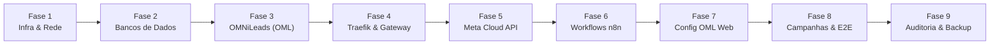
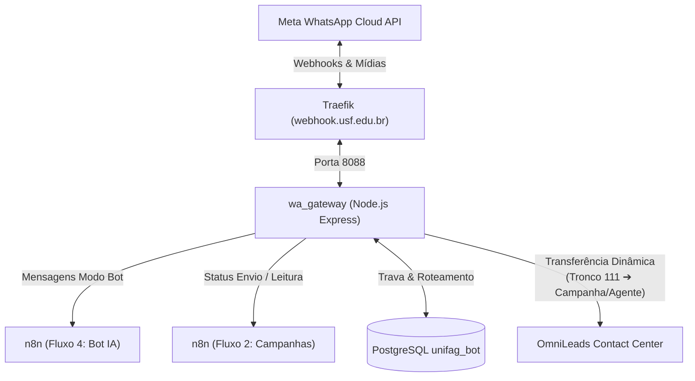
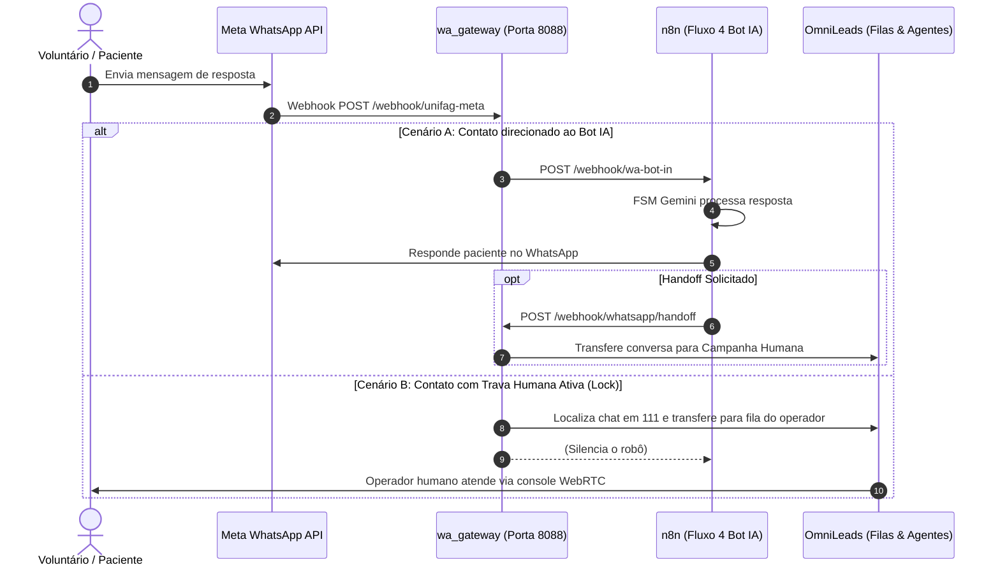

# Playbook de Implantação do Zero — Ecossistema UNIFAG & OMNiLeads

Este documento é o **Guia Mestre de Implantação do Zero (Ground Zero to Production)** do ecossistema de comunicação, triagem automatizada (IA), telefonia IP e campanhas ativas da **UNIFAG**. Ele consolida em uma sequência lógica, operacional e testada todos os procedimentos necessários para subir a infraestrutura completa, interligar os microsserviços, configurar a Meta Cloud API, provisionar o OMNiLeads e disparar as primeiras campanhas com handoff humano.

---

## 🗺️ Mapa das 9 Fases de Implantação



| Fase | Escopo Principal | Servidores / Componentes Envolvidos |
|---|---|---|
| **Fase 1** | **Infraestrutura, Rede, DNS e Kernel** | Todos os nós (`dcntxconfoml01`, `dcntxomlusf01`, `DCNTXRDSTATION`) |
| **Fase 2** | **Bancos de Dados Relacionais** | Docker Compose (`mysql:8.0`, `postgres:16-alpine`) |
| **Fase 3** | **Contact Center OMNiLeads** | Ansible Deploy Tool, Podman (Asterisk, Kamailio, RTPEngine) |
| **Fase 4** | **Traefik & Gateway de Borda (`wa_gateway`)** | Docker Swarm (`node_meta_wa_gateway`), Let's Encrypt |
| **Fase 5** | **Meta WhatsApp Cloud API** | Meta Business Manager, WABA, Phone Number ID, Templates |
| **Fase 6** | **Orquestração de Automações (n8n)** | n8n Engine (Fluxos 1, 2, 3 e 4), Google Sheets API |
| **Fase 7** | **Parametrização Web do OMNiLeads** | Console Web `oml.usf.edu.br` (Tronco 111, Filas, Agentes, DIDs) |
| **Fase 8** | **Criação de Campanhas e Testes Ponta a Ponta** | Disparos ativos, FSM Bot IA, Travas Humanas e Atribuição |
| **Fase 9** | **Checklist de Homologação, Monitoramento e Backup** | Rotinas preventivas, snapshots e planos de contingência |

---

## Fase 1: Preparação de Infraestrutura, Rede e SO

### 1.1 Matriz de Servidores e Papéis

Garanta que as 3 máquinas virtuais/físicas estejam provisionadas e acessíveis via rede corporativa:

| Servidor / Hostname | IP / Acesso | Finalidade | Tecnologias Chave |
|---|---|---|---|
| **`dcntxconfoml01`** | SSH Porta 22 (`root`) | Nó central de deploy e orquestração do OMNiLeads | Git, Ansible |
| **`dcntxomlusf01`** | `172.16.39.15` (SSH 22) | Nó de execução do OMNiLeads e Telefonia IP | Podman, Asterisk 20, Kamailio, RTPEngine, PostgreSQL |
| **`DCNTXRDSTATION`** | IP local (SSH 22) | Nó de orquestração web, microsserviços e bancos | Docker Swarm, Traefik, Node.js (`wa_gateway`), n8n, MySQL, PostgreSQL |

### 1.2 Configuração de DNS e Certificados Públicos

Configure as seguintes entradas DNS autoritativas apontando para os IPs de borda:
* `oml.usf.edu.br` ➔ Aponta para o IP público de acesso ao OMNiLeads (NAT para `172.16.39.15`).
* `webhook.usf.edu.br` ➔ Aponta para o IP público do servidor Traefik (`DCNTXRDSTATION`).

### 1.3 Regras de Borda e Firewall Institucional

Libere previamente no Firewall corporativo as seguintes portas:

```
[UDP] 10000:20000  -> 172.16.39.15 (Áudio RTP/SRTP RTPEngine - Mídia Telefônica)
[TCP] 8089 / 443   -> 172.16.39.15 (WebSockets Seguro WSS Kamailio / Console OML)
[UDP] 5060         -> 172.16.39.15 (Sinalização SIP Operadora / Troncos VoIP)
[TCP] 80 / 443     -> DCNTXRDSTATION (Traefik / Webhooks Meta / HTTPS)
```

### 1.4 Tuning de Kernel Linux (Nó de Telefonia `dcntxomlusf01`)

No servidor `172.16.39.15`, execute como `root`:

```bash
# 1. Desativar IPv6 e diminuir swappiness
cat <<EOF >> /etc/sysctl.conf
net.ipv6.conf.all.disable_ipv6 = 1
net.ipv6.conf.default.disable_ipv6 = 1
vm.swappiness = 1
EOF
sysctl -p

# 2. Ajustar limites de arquivos e processos para Asterisk/Podman
cat <<EOF >> /etc/security/limits.conf
* soft nofile 1048576
* hard nofile 1048576
* soft nproc 191252
* hard nproc 191252
* soft memlock 8192
* hard memlock 8192
EOF
```

---

## Fase 2: Implantação da Camada de Banco de Dados

Os bancos relacionais que atendem os fluxos do n8n e o controle de travas do `wa_gateway` rodam sob Docker:

```
Bancos de Dados:
├── MySQL 8.0 (bot_control na porta 3306)
└── PostgreSQL 16 (unifag_bot na porta 5434 ou 5432)
```

### 2.1 Configurar o Arquivo `.env`

No diretório raiz do projeto (`BOT UNG`):

```bash
cp .env.example .env
```

Edite o `.env` com senhas fortes:

```ini
MYSQL_ROOT_PASSWORD=*****
MYSQL_DATABASE=bot_control
MYSQL_USER=bot_user
MYSQL_PASSWORD=*****
MYSQL_PORT=3306

POSTGRES_USER=unifag_admin
POSTGRES_PASSWORD=*****
POSTGRES_DB=unifag_bot
POSTGRES_PORT=5434
```

### 2.2 Iniciar os Containers de Banco

```bash
docker compose up -d postgres mysql
```

### 2.3 Estrutura Automática de Tabelas (DDL)

Os containers executam automaticamente os scripts em `./mysql/init` e `./postgres/init`:

1. **MySQL (`bot_control`)**:
   * `campanha_contatos_resumo`: Estado consolidado dos disparos e janelas de 24h.
   * `campanha_agendamentos`: Tabela de atribuição final de consultas clínicas.
   * `bot_contact_control`: Travas ativas (`bot_locked`, `lock_reason`, `source`).
   * `meta_eventos_auditoria`: Log detalhado de callbacks da Meta.
2. **PostgreSQL (`unifag_bot`)**:
   * `unifag_bot.sessoes_atendimento`: Estado FSM do Bot, dados coletados e handoff.
   * `unifag_bot.historico_mensagens`: Memória conversacional Q&A da IA.
   * `unifag_bot.roteamento_oml_humano`: Cache de conversas transferidas no OML.
   * `unifag_bot.processed_messages`: Deduplicação estrita de `wamid`.

---

## Fase 3: Implantação e Provisionamento do OMNiLeads

A instalação da telefonia e contact center é orquestrada pelo Ansible a partir de `dcntxconfoml01`.

### 3.1 Clonar o Repositório e Selecionar a Versão Estável

No nó de deploy (`dcntxconfoml01`):

```bash
cd ~
git clone https://gitlab.com/omnileads/omldeploytool.git
cd ~/omldeploytool
git fetch --all --tags
# Selecione a release homologada (ex.: v1.28.x):
git checkout tags/v1.x.x -b release-producao
```

### 3.2 Configurar a Instância USF (`instances/oml_usf`)

Acesse o diretório do tenant:

```bash
cd ~/omldeploytool/ansible/instances/oml_usf
```

Gere ou copie os certificados públicos oficiais `cert.pem` e `key.pem` emitidos para `oml.usf.edu.br`.

Edite o arquivo `inventory.yml`:

```yaml
vars:
  ansible_ssh_port: 22
  ansible_user: root
  infra_env: hybrid
  certs: custom

hosts:
  oml_usf:
    tenant_id: oml_usf
    ansible_host: 172.16.39.15
    omni_ip_lan: 172.16.39.15
    fqdn: oml.usf.edu.br
    nat_ip_addr: 200.X.X.X  # Preencher com o IP Público NAT corporativo
    certs: custom
    cert_file_name: cert.pem
    key_file_name: key.pem
```

### 3.3 Executar o Deploy Inicial do Tenant

```bash
./deploy.sh --action=install --tenant=oml_usf
```

O Ansible configurará no nó `172.16.39.15`:
* Motor Podman com containers `oml-asterisk-server` (v20.16.0), `dialer-asterisk` (v20.10.0), `oml-kamailio-server`, `rtpengine` e `oml-postgresql`.
* Criação do usuário administrativo da web UI.

### 3.4 Validação Imediata da Telefonia

No nó `172.16.39.15`:

```bash
# Validar se o Kamailio está ativo
service kamailio status

# Validar se o Asterisk está respondendo
podman exec oml-asterisk-server asterisk -rx "core show uptime"
```

---

## Fase 4: Implantação do Traefik & Gateway de Borda (`wa_gateway`)

O **`wa_gateway`** é o microsserviço de borda central (desenvolvido em **Node.js 20 com Express**) que atua como o cérebro de infraestrutura entre a **Meta WhatsApp Cloud API**, o **OMNiLeads (OML)** e os fluxos do **n8n**. Ele roda sob **Docker Swarm** no servidor `DCNTXRDSTATION` no diretório `/opt/wa-gateway`.

### 4.1 O que é o `wa_gateway` e por que ele é indispensável?



O gateway resolve cinco gargalos críticos de arquitetura que não podem ser tratados diretamente pelo n8n ou pelo OmniLeads isolados:

1. **Roteamento Inteligente (Bot vs. Humano)**:
   Ao receber um webhook da Meta, verifica em menos de 1ms se o contato possui uma trava de atendimento humano ativa. Se sim, roteia para o OML e silencia o robô; se não, encaminha para o Fluxo 4 do n8n para triagem inteligente.
2. **Engine de Travas de Atendimento (`humanLocks`)**:
   Mantém uma tabela hash em memória (`Map`) sincronizada com o banco PostgreSQL `unifag_bot.sessoes_atendimento`. Endpoints dedicados (`/control/lock/:wa_id/on` e `/control/lock/:wa_id/off`) permitem travar e destravar contatos dinamicamente.
3. **Transferência Dinâmica no OmniLeads (OML 2.5.6)**:
   No OML 2.5.6, as mensagens chegam exclusivamente em uma fila fixa: a **Campanha 111 (`UNIFAG_WHATSAPPV1`)**. O `wa_gateway` autentica na API do OML (emulando sessão Django com CSRF token), localiza a conversa ativa via `filter_chats` e transfere a conversa dinamicamente para a campanha ou operador configurado no n8n.
4. **Ponte de Mídia com Cache Local (`media-cache`)**:
   O OmniLeads não tem permissão para autenticar no CDN da Meta para baixar áudios, imagens e documentos. O gateway intercepta essas mídias, faz o download autenticado via `META_TOKEN`, salva em `/app/media-cache` com validade de 7 dias e fornece URLs públicas seguras (`/meta/media/:token`) servidas pelo Traefik.
5. **Guardião de Subscrição WABA (*Watchdog*)**:
   Em contas corporativas da Meta, outros aplicativos ou atualizações podem revogar a inscrição do webhook. Um cron interno roda a cada 60s inspecionando `GET /{META_WABA_ID}/subscribed_apps`; caso desinscrito, executa o auto-reparo imediato.

---

### 4.2 Passo a Passo de Instalação do `wa_gateway` do Zero

A implantação é realizada no servidor `DCNTXRDSTATION`:

#### Passo 1: Criar Estrutura de Diretórios e Permissões
```bash
sudo mkdir -p /opt/wa-gateway/media-cache
sudo chmod 777 /opt/wa-gateway/media-cache
cd /opt/wa-gateway
```

#### Passo 2: Criar o Manifesto `package.json`
Crie o arquivo `/opt/wa-gateway/package.json`:
```json
{
  "name": "wa-gateway",
  "version": "1.0.0",
  "description": "Gateway de Orquestração WhatsApp Meta, OML e n8n",
  "main": "index.js",
  "scripts": {
    "start": "node index.js"
  },
  "dependencies": {
    "express": "^4.19.2",
    "pg": "^8.11.3",
    "axios": "^1.6.8"
  }
}
```

#### Passo 3: Criar os Arquivos de Credenciais do OMNiLeads
O gateway requer autenticação REST e de Sessão Django:
```bash
# 1. Credencial REST API OML
cat <<EOF > /opt/wa-gateway/.oml-api-unifag.cred
OML_TOKEN=SEU_TOKEN_API_GERADO_NO_OML
EOF

# 2. Credencial Session Django (Admin OML para CSRF/SessionId)
cat <<EOF > /opt/wa-gateway/.oml-session-admin.cred
username=admin
password=SENHA_ADMIN_OML
EOF

chmod 600 /opt/wa-gateway/.*.cred
```

#### Passo 4: Código da Aplicação (`index.js`)
Coloque o arquivo `index.js` em `/opt/wa-gateway/index.js`. O código deve inicializar o Express, capturar o `rawBody` para validação HMAC SHA-256 da Meta, instanciar a pool do PostgreSQL (`unifag_bot`), e configurar os endpoints `/webhook/unifag-meta`, `/control/lock/...` e o *Watchdog*. Para a referência completa do código, consulte o [Guia de Arquitetura do Gateway](arquitetura/gateway-orquestracao.md).

#### Passo 5: Implantar a Stack no Docker Swarm (`node_meta`)
Crie o arquivo `/opt/wa-gateway/docker-compose.yml`:

```yaml
version: "3.7"

services:
  wa_gateway:
    image: node:20
    restart: unless-stopped
    working_dir: /app
    volumes:
      - /opt/wa-gateway:/app
    environment:
      TZ: America/Sao_Paulo
      PORT: 8088
      VERIFY_TOKEN: "usf_verify_token_seguro_2026"
      N8N_BOT_URL: http://n8n:5678/webhook/wa-bot-in
      N8N_STATUS_URL: http://n8n:5678/webhook/unifag-meta-status
      OML_HANDOFF_URL: https://oml.usf.edu.br/webhooks/whatsapp/incoming/
      OML_API_BASE_URL: https://oml.usf.edu.br
      OML_API_CREDENTIAL_FILE: /app/.oml-api-unifag.cred
      OML_SESSION_CREDENTIAL_FILE: /app/.oml-session-admin.cred
      META_TOKEN: "EAA..." # Token permanente de sistema da Meta
      META_GRAPH_VERSION: v20.0
      META_WABA_ID: "1156659843285011"
      META_APP_ID: "1937257670036344"
      PUBLIC_WEBHOOK_BASE_URL: https://webhook.usf.edu.br
      MEDIA_CACHE_DIR: /app/media-cache
      MEDIA_LINK_TTL_HOURS: 168
      MEDIA_MAX_BYTES: 26214400 # 25MB
      MEDIA_PUBLIC_PREFIX: /meta/media
      WEBHOOK_WATCHDOG_ENABLED: "true"
      WEBHOOK_WATCHDOG_INTERVAL_MS: 60000
      PGHOST: postgres
      PGPORT: 5432
      PGDATABASE: unifag_bot
      PGUSER: unifag_admin
      PGPASSWORD: unifag_bot_pass_2026
    command: >
      sh -c "npm install && node index.js"
    networks:
      - network_public
    deploy:
      mode: replicated
      replicas: 1
      placement:
        constraints:
          - node.role == manager
      labels:
        - "traefik.enable=true"
        - "traefik.http.routers.wa_gateway.rule=Host(`webhook.usf.edu.br`) && (PathPrefix(`/meta`) || PathPrefix(`/webhook/unifag-meta`))"
        - "traefik.http.routers.wa_gateway.priority=100"
        - "traefik.http.routers.wa_gateway.entrypoints=websecure"
        - "traefik.http.routers.wa_gateway.tls.certresolver=letsencryptresolver"
        - "traefik.http.middlewares.wa_meta_to_webhook.replacepathregex.regex=^/meta/(.*)"
        - "traefik.http.middlewares.wa_meta_to_webhook.replacepathregex.replacement=/webhook/$1"
        - "traefik.http.services.wa_gateway.loadbalancer.server.port=8088"

networks:
  network_public:
    external: true
```

Faça o deploy do serviço no Swarm:
```bash
docker stack deploy -c /opt/wa-gateway/docker-compose.yml node_meta
```

---

### 4.3 Comandos Operacionais de Teste e Diagnóstico

Execute os testes para certificar que o gateway está 100% operacional:

| Finalidade do Teste | Comando Linux / HTTP | Resposta Esperada |
|---|---|---|
| **Acompanhar logs em tempo real** | `docker service logs -f --tail 100 node_meta_wa_gateway` | Logs da subida do Express e conexão com Postgres. |
| **Checar integridade da API (`/health`)** | `curl -s http://localhost:8088/health \| jq .` | JSON com `"status": "ok"`, `"db": "connected"`. |
| **Forçar checagem do Watchdog Meta** | `curl -s http://localhost:8088/control/meta-watchdog` | Confirmação de inscrição no WABA. |
| **Destravar contato manualmente (CLI)** | `curl -X POST http://localhost:8088/control/lock/5511999998888/off` | Contato liberado para voltar ao Bot de IA. |
| **Travar contato para Campanha OML** | `curl -X POST http://localhost:8088/control/lock/5511999998888/on -H "Content-Type: application/json" -d '{"destination_type":"campaign","oml_campaign_id":"112"}'` | Contato roteado exclusivamente para operadores. |

---

## Fase 5: Configuração da Meta WhatsApp Cloud API

No painel **Meta Business Manager** e **Meta for Developers**:

1. **Criar Aplicativo**: Crie um app do tipo *Business* e adicione o produto *WhatsApp*.
2. **Gerar Token de Sistema Permanente**:
   * Em *Configurações do Negócio > Usuários do Sistema*, crie um usuário admin.
   * Atribua permissões: `whatsapp_business_messaging`, `whatsapp_business_management`.
   * Gere um token de acesso permanente e salve na variável `META_TOKEN`.
3. **Configurar o Webhook na Meta**:
   * **URL de Retorno**: `https://webhook.usf.edu.br/webhook/unifag-meta`
   * **Token de Verificação**: `usf_verify_token_seguro_2026` (o mesmo valor de `VERIFY_TOKEN`).
   * **Assinar Campos de Evento**: `messages`.
4. **Criar Templates de Mensagens**:
   * Crie o modelo de convocação/pesquisa (ex.: `pesquisa_clinica_unifag_v1`).
   * Crie o modelo padrão de lembrete com botões interativos ("Sim, confirmo", "Preciso remarcar", "Desejo falar com atendente").

---

## Fase 6: Importação e Configuração dos Fluxos no n8n

O n8n opera os 4 fluxos principais do ecossistema:

### 6.1 Cadastro de Credenciais no n8n

Acesse a console do n8n (`http://DCNTXRDSTATION:5678`) e configure:

1. **MySQL (`bot_control`)**:
   * Host: `mysql`, Porta: `3306`, Database: `bot_control`, User: `bot_user`.
2. **PostgreSQL (`unifag_bot`)**:
   * Host: `postgres`, Porta: `5432`, Database: `unifag_bot`, User: `unifag_admin`.
3. **PostgreSQL Read-Only (`OML_Postgres_RO`)**:
   * Host: `172.16.39.15`, Porta: `5432`, Database: `omnileads`, User: `oml_ro`.
4. **Google Sheets OAuth2 API**:
   * Autenticado com a conta institucional proprietária da planilha `AGENDA 2026`.
5. **Meta WhatsApp Cloud API (Header Auth)**:
   * Header: `Authorization: Bearer <META_TOKEN>`.
6. **Google Gemini / OpenAI API**:
   * Chave de API para o cérebro da FSM no Fluxo 4.

### 6.2 Importação dos Workflows

Importe os arquivos JSON disponibilizados na raiz:

```
Workflows Core:
├── 01-sincronizacao-agenda.json    (ID: 1yuqoeWSRkcq1fM2)
├── 02-campanhas-whatsapp.json      (ID: wpwQBe7OIUvzGvRZ)
├── 03-dashboard-relatorios-bi.json (ID: vETUs2AnPvfrSHSU)
└── 04-bot-triagem-atendimento.json (ID: mtbFAvtEk3YwcsAB)
```

Ative todos os workflows (`Active = True`).

---

## Fase 7: Parametrização Web do OMNiLeads

Acesse [`https://oml.usf.edu.br`](https://oml.usf.edu.br) com o usuário administrador.

### 7.1 Configurar o Tronco de Entrada WhatsApp (Campanha 111)

1. Crie uma campanha de WhatsApp de entrada:
   * **Nome da Campanha**: `UNIFAG_WHATSAPPV1`
   * **ID da Campanha**: Deve ser a campanha **`111`** (destino fixo onde o `wa_gateway` entrega as conversas antes do handoff dinâmico).
2. Configure o Webhook Receptivo no OML apontando para:
   `https://webhook.usf.edu.br/webhook/unifag-meta-status` (para sincronizar eventos de operador).

### 7.2 Criar Campanhas de Atendimento Humano e Filas

1. Crie as campanhas de destino (ex.: `Pesquisa Clinica Triagem`, `Atendimento Geral`, `Remarcacoes`).
2. Vincule os grupos de operadores a cada campanha.

### 7.3 Configuração de Rota de Telefonia Convencional (DID)

Caso a unidade também receba ligações telefônicas da operadora:
* **Nome da Rota**: `TesteUSF`
* **Número DID**: `5677158345`
* **Destino**: Campanha de entrada `0800_USF`

---

## Fase 8: Criação de Campanhas e Teste Ponta a Ponta

### 8.1 Disparo de Campanha Ativa

1. No portal web do **Fluxo 2** (`/webhook/envio-unifag-portal`):
   * Selecione o modelo aprovado na Meta.
   * Faça upload do arquivo CSV com contatos higienizados (formato E.164: `5511999998888`).
   * Escolha o tipo de destinação: **Bot de Triagem (IA)** ou **Campanha Humana OML**.
2. O n8n processa a fila, valida a proteção de 24h (`blocked_24h = 0`), registra no MySQL e envia via Graph API.

### 8.2 Comportamento da Resposta do Cliente



---

## Fase 9: Checklist de Validação, Monitoramento e Backup

### 9.1 Checklist de Homologação Final

- [ ] **Kamailio Ativo**: `service kamailio status` retorna `active (running)`.
- [ ] **WebRTC Conectando**: Operador loga na console sem erro de WSS/SSL.
- [ ] **Watchdog Ativo**: Log do `wa_gateway` reporta `[Watchdog] WABA subscription verified`.
- [ ] **Cache de Mídia Operante**: Áudios e fotos enviados pelo cliente aparecem na console do OML.
- [ ] **Atribuição da Agenda**: Linha adicionada na planilha `AGENDA 2026` sincroniza no MySQL `campanha_agendamentos`.
- [ ] **Dashboard de BI**: Painel executivo do Fluxo 3 exibe custos oficiais da Meta via `/template_analytics`.

### 9.2 Script Preventivo de Backup Diário

Adicione ao `crontab` do nó de telefonia (`172.16.39.15`):

```bash
# Backup diário às 02h00 da manhã
0 2 * * * podman exec -t oml-postgresql pg_dumpall -U omnileads > /opt/backups/oml_pg_$(date +\%Y\%m\%d).sql
0 3 * * * tar -czf /opt/backups/oml_media_$(date +\%Y\%m\%d).tar.gz /opt/omnileads/media/
```

E no servidor `DCNTXRDSTATION`:

```bash
# Backup diário das bases do bot e campanhas
0 2 * * * docker exec bot_control_mysql mysqldump -u root -pbot_control_root_2026 bot_control > /opt/backups/mysql_$(date +\%Y\%m\%d).sql
0 2 * * * docker exec unifag_bot_postgres pg_dumpall -U unifag_admin > /opt/backups/postgres_$(date +\%Y\%m\%d).sql
```
